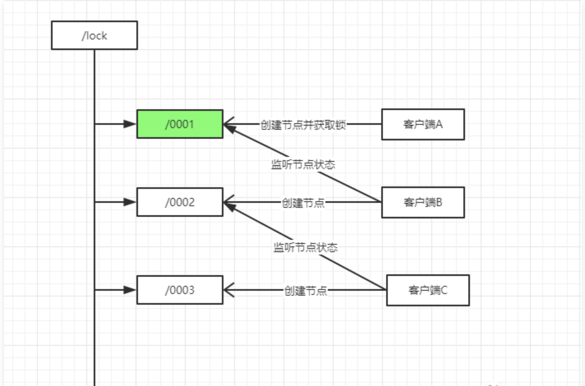

# 分布式锁

##基于数据库做分布式锁

> 基于乐观锁：利用表主键唯一或者唯一性约束做分布式锁

利用主键唯一的特性，如果有多个请求同时提交到数据库的话，数据库会保证只有一个操作可以成功，那么我们就可以认为操作成功的那个线程获得了该方法的锁，当方法执行完毕之后，想要释放锁的话，删除这条数据库记录即可。

存在的问题：

- 这把锁强依赖数据库的可用性，数据库是一个单点，一旦数据库挂掉，会导致业务系统不可用。
- 这把锁没有失效时间，一旦解锁操作失败，就会导致锁记录一直在数据库中，其他线程无法再获得到锁。
- 这把锁只能是非阻塞的，因为数据的 insert 操作，一旦插入失败就会直接报错。没有获得锁的线程并不会进入排队队列，要想再次获得锁就要再次触发获得锁操作
- 这把锁是非重入的，同一个线程在没有释放锁之前无法再次获得该锁。因为数据中数据已经存在了
- 这把锁是非公平锁，所有等待锁的线程凭运气去争夺锁。
- 在 MySQL 数据库中采用主键冲突防重，在大并发情况下有可能会造成锁表现象

解决上面问题的方案：

- 数据库是单点？搞两个数据库，数据之前双向同步，一旦挂掉快速切换到备库上
- 没有失效时间？只要做一个定时任务，每隔一定时间把数据库中的超时数据清理一遍
- 非阻塞的？搞一个 while 循环，直到 insert 成功再返回成功
- 非重入的？在数据库表中加个字段，记录当前获得锁的机器的主机信息和线程信息，那么下次再获取锁的时候先查询数据库，如果当前机器的主机信息和线程信息在数据库可以查到的话，直接把锁分配给他就可以了。
- 非公平的？再建一张中间表，将等待锁的线程全记录下来，并根据创建时间排序，只有最先创建的允许获取锁。
- 比较好的办法是在程序中生产主键进行防重。

##基于Redis做分布式锁

基于Redis的setnx()、expire()做分布式锁

setnx 的含义就是 SET if Not Exists，其主要有两个参数 setnx(key, value)。该方法是原子的，如果 key 不存在，则设置当前 key 成功，返回 1；如果当前 key 已经存在，则设置当前 key 失败，返回 0。

expire 设置过期时间，要注意的是 setnx 命令不能设置 key 的超时时间，只能通过 expire() 来对 key 设置。

setnx与expire 两个命令是非原子性的，可能出现死锁问题，使用set命名的原子操作可以实现分布式锁
```
set key value [EX seconds] [PX milliseconds] [NX|XX]
```

存在的问题：

锁误解除： 如果线程 A 成功获取到了锁，并且设置了过期时间 30 秒，但线程 A 执行时间超过了 30 秒，锁过期自动释放，此时线程 B 获取到了锁；随后 A 执行完成，线程 A 使用 DEL 命令来释放锁，但此时线程 B 加的锁还没有执行完成，线程 A 实际释放的线程 B 加的锁。

解决办法：通过在 value 中设置当前线程加锁的标识，在删除之前验证 key 对应的 value 判断锁是否是当前线程持有。可生成一个 UUID 标识当前线程，使用 lua 脚本做验证标识和解锁操作。

超时解锁导致并发：如果线程 A 成功获取锁并设置过期时间 30 秒，但线程 A 执行时间超过了 30 秒，锁过期自动释放，此时线程 B 获取到了锁，线程 A 和线程 B 并发执行。

解决办法：
将过期时间设置足够长，确保代码逻辑在锁释放之前能够执行完成。
为获取锁的线程增加守护线程，为将要过期但未释放的锁增加有效时间。

##另一种方式：使用开源框架Redisson实现分布式锁
```
Config config = new Config(); 
config.useClusterServers() 
.addNodeAddress("redis://192.168.31.101:7001") 
.addNodeAddress("redis://192.168.31.101:7002") 
.addNodeAddress("redis://192.168.31.101:7003") 
.addNodeAddress("redis://192.168.31.102:7001") 
.addNodeAddress("redis://192.168.31.102:7002") 
.addNodeAddress("redis://192.168.31.102:7003"); 
 
RedissonClient redisson = Redisson.create(config); 
 
 
RLock lock = redisson.getLock("anyLock"); 
lock.lock(); 
lock.unlock();
```

- Redisson 所有指令都通过 Lua 脚本执行，Redis 支持 Lua 脚本原子性执行
- Redisson 设置一个 Key 的默认过期时间为 30s，如果某个客户端持有一个锁超过了 30s 怎么办？
- Redisson 中有一个 Watchdog 的概念，翻译过来就是看门狗，它会在你获取锁之后，每隔 10s 帮你把 Key 的超时时间设为 30s。

这样的话，就算一直持有锁也不会出现 Key 过期了，其他线程获取到锁的问题了。

-Redisson 的“看门狗”逻辑保证了没有死锁发生。(如果机器宕机了，看门狗也就没了。此时就不会延长 Key 的过期时间，到了 30s 之后就会自动过期了，其他线程可以获取到锁)


##基于 Redlock 做分布式锁

##基于ZK做分布式锁

分布式锁的思路是每个客户端都在某个目录下注册一个临时有序节点，每次最小的节点会获取锁，当前节点会去监听上一个较小节点，如果较小节点失效之后，就会去获取锁。



创建临时有序节点是公平锁，每次最小的节点获取锁。 监听锁的释放。由于是临时节点，zk断开的话节点会被删除，避免了死锁。

创建临时有序节点可以避免羊群效应。

创建单个节点是非公平锁，会存在羊群效应。


##基于zookeeper实现和redis实现在性能上有什么差异

对于 Redis 的分布式锁而言，它有以下缺点：

- 它获取锁的方式简单粗暴，获取不到锁直接不断尝试获取锁，比较消耗性能。
- 另外来说的话，Redis 的设计定位决定了它的数据并不是强一致性的，在某些极端情况下，可能会出现问题。锁的模型不够健壮
- Redis 分布式锁，其实需要自己不断去尝试获取锁，比较消耗性能。

所以使用 Redis 作为分布式锁也不失为一种好的方案，最重要的一点是 Redis 的性能很高，可以支撑高并发的获取、释放锁操作。

对于 ZK 分布式锁而言:

- ZK 天生设计定位就是分布式协调，强一致性。锁的模型健壮、简单易用、适合做分布式锁。
- 如果获取不到锁，只需要添加一个监听器就可以了，不用一直轮询，性能消耗较小。

但是 ZK 也有其缺点：如果有较多的客户端频繁的申请加锁、释放锁，对于 ZK 集群的压力会比较大。


