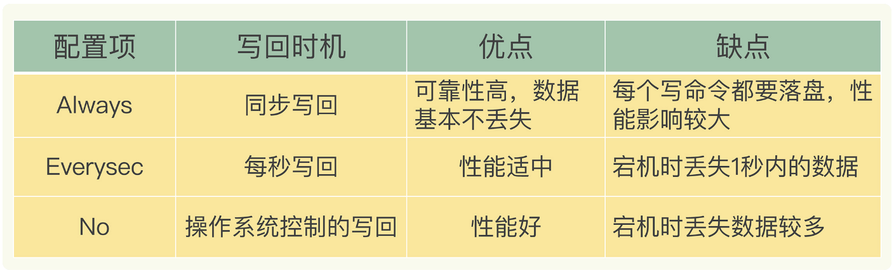
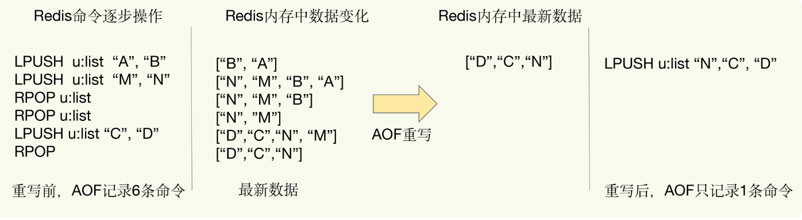
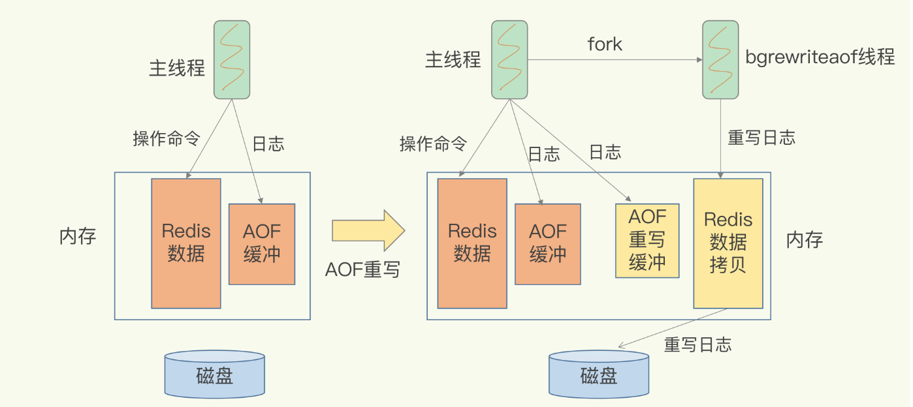

# AOF日志

##Redis如何实现数据持久化，Redis服务器宕机，如何恢复数据

Redis的持久化主要有两大机制，即AOF日志和RDB快照

AOF日志与数据库日志相反，它是写后日志，即Redis先执行命令，把数据写入内存，然后才记录日志。传统数据库日志，如redo log ,记录的是修改后的数据，AOF记录的是Redis
收到的每条命令。

好处：只有命令执行成功才记录日志，避免出现记录错误的日志，命令执行后才记录日志，所以不会阻塞当前的写操作。

AOF日志潜在的两个风险点

- 执行完命令后，没来得及记录日志，服务器宕机了，就无法用日志进行恢复了
- AOF虽然避免了当前写操作，但可能会给下一个操作带来阻塞风险，因为AOF在主线程中执行，日志文件写磁盘的慢可能会导致后续操作无法执行。

针对改问题的解决办法

##AOF日志的三种写回策略

- Always 同步写回，每个命令执行完，立马同步的将日志写回磁盘。
- EverySec 每秒写回，每个命令执行完，先把日志写到AOF文件的内存缓冲区，每隔一秒把缓冲区的内容写入磁盘。
- No 操作系统控制的写回，每个命令执行完，先把日志写到AOF文件的内存缓冲区，由操作系统决定何时写入磁盘。

三种写回策略的优缺点。

高性能选No策略、高可靠选Always策略、折中选每秒写回策略。

仍然存在的风险点，AOF文件过大带来的性能问题。
- 文件系统本身对文件大小的限制，无法保存过大文件
- 文件太大，追加命令效率低下。
- 发生宕机，日志文件过大，恢复时间长，影响Redis正常使用

##AOF日志文件过大解决办法：AOF日志重写

日志重写，就是将Redis多条命中合并为一条命中，忽略中间过程，保证最终结果的一致性。在日志恢复时，只要执行这条命令，就可以恢复。

##AOF日志重写会阻塞吗？

和AOF日志由主线程写回不同，AOF日志重写是由后台线程bgrewriteaof来完成的，是为了避免阻塞主线程。

日志重写过程：
- 一处拷贝： 主线程fork出后台子线程后，主线程内存拷贝一份给子线程，子线程将拷贝的数据重写入日志。
- 两处日志： 正在使用的AOF日志与AOF重写日志

重写日志过程

##常见面试题

1、 AOF日志重写过程中潜在的风险点。

重写时，主线程会fork一个子线程进行处理，fork子线程可能存在阻塞主线程的风险。
读写操作bigkey风险

2、 AOF重写也有一个重写日志，为什么不共享使用AOF本身的日志呢。

如果都使用AOF日志的话，主线程要写，子线程也要写，两者会竞争文件系统的锁，会对主线程性能造成影响。
