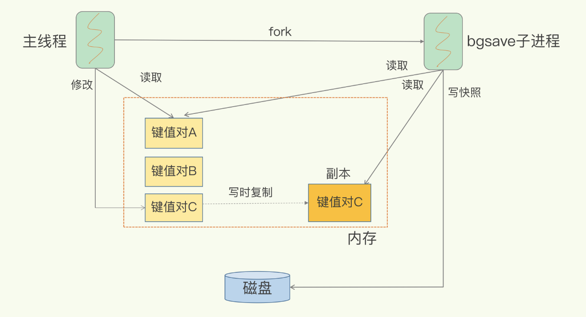
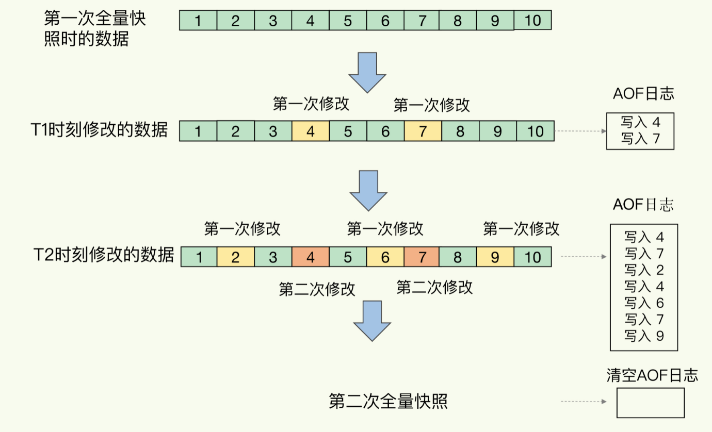

# Redis内存快照RDB

Redis服务器宕机，可以使用AOF日志进行恢复，如果AOF日志过大，故障恢复时间过长，影响到Redis的正常使用。

这里我们讨论Redis的另外一种持久化方式，RDB快照，所谓内存快照，就是指内存中的数据在某一时间的状态记录。快照文件称为RDB文件(Redis DataBase)

与AOF的区别是，AOF记录的是操作命令，RDF记录的是某一时刻的数据，并不是操作，在做数据恢复时，可以直接将RDB文件读入内存，实现快速恢复。

关键问题：

- 对哪些数据做快照，快照的执行效率。 全量快照,对所有数据做快照。
- 做快照时，还能进行增删改查吗，关系到Redis是否阻塞，能否同时处理正常请求。

##Redis如何生成RDB文件
- save: 在主线程中执行，会导致阻塞。
- bgsave: 创建一个子线程,专门用于写入RDB文件，避免阻塞主线程，Redis默认配置。

**快照时数据能修改吗？**
快照时数据能修改，Redis借助操作系统提供的写时复制技术(Copy-On-Write)在执行快照的同事，支持处理写操作
主线程在子线程执行RDB操作的时候修改了数据，会生成修改数据的副本，子线程读取副本写入RDB文件。

写时复制过程

##Redis多久做一次快照

频繁的做全量快照，会带来两方面的开销，已方面，频繁将全量数据写入磁盘，给磁盘带来很大的压力，多个快照竞争有限的磁盘宽带，前一个快照还没做完，后一个又来了，容易造成恶心循环，另已方面，bgsave子线程需要通过fork操作从主线程创建出来，
fork过程会造成主线程阻塞，频繁fork会阻塞主线程。

解决办法：做一次全量快照后，后续的快照只对修改的数据进行快照记录，我们只需要记住哪些数据被修改了。

到这里你可能发现了，虽然和AOF相比，快照的恢复速度快，但是快照的频率不好把握，如果频率过低，数据丢失会多，频率高的话又有额外开销。

##混合使用AOF日志和内存快照
内存快照以一定的评率执行，在两次快照之间，使用AOF日志记录这期间所有命令操作。

该方法的优点：
- 快照不用频繁的执行，避免了频繁fork对主线程的影响。
- AOF日志只记录两次快照之间的操作，不会出现AOF文件过大的情况，也避免了AOF重新带来的开销。

##总结

RDB文件的优势在于，可以快速恢复数据库，只需要把RDB文件直接读入内存，这样可以避免AOF需要顺序、逐一重新执行命令带来的低效性能问题。

使用AOF还是RDB快照?选型问题

- 数据不能丢失，内存快照和AOF的混合使用是一个很好的选择
- 如果允许分钟级别的数据丢失，可以只使用RDB
- 如果只使用AOF,优先使用everysec的 配置选项，因为他在可靠性和性能直接取了一个平衡。

##常见面试题

