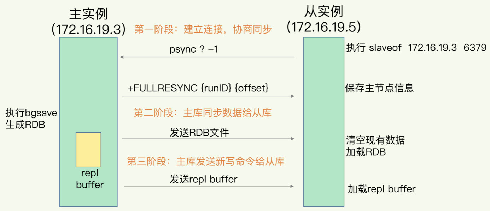
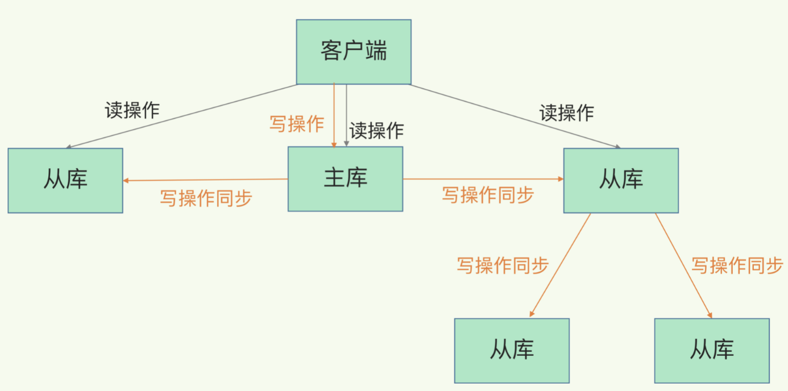
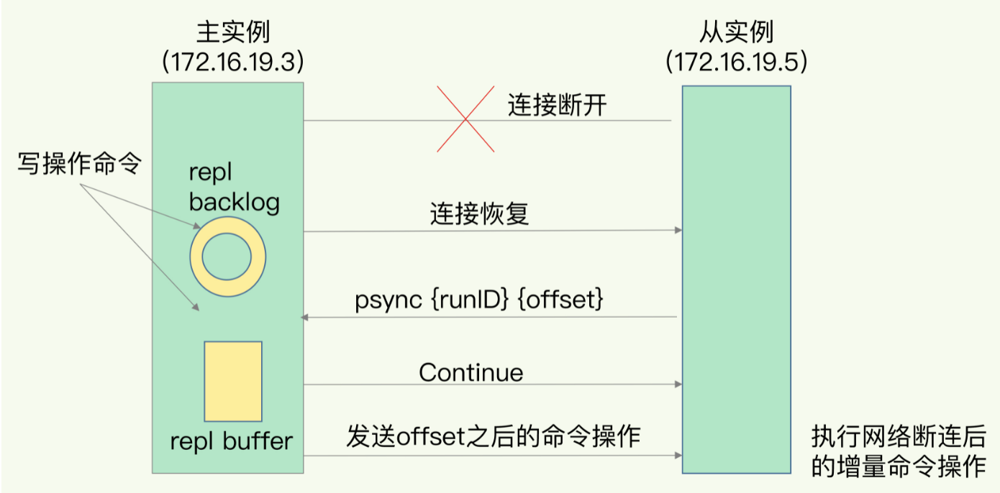

# Redis数据同步：主从数据一致性问题

AOF和RDB ，如果Redis发生了宕机，他们可以分别通过回放日志和重新读入RDB文件的方式恢复数据，保证尽量少丢失数据，提升可靠性。
如果我们只运行了一个Redis实例，如果实例宕机了，故障恢复期间就不可用，无法处理新来的数据请求。

为解决上述问题，Redis的做法就是增加副本冗余量，将一份数据同时保存在多个实例上，一个实例宕机，其它实例还可以正常提供服务。

##Redis 主从模式

主从库之间采用的是读写分离模式
- 读操作： 主库、从库都可以接收
- 写操作： 首先到主库执行，然后，主库将写操作同步给从库。(为了避免主从数据一致性问题，同时写主库与从库，涉及到加锁等额外开销操作)

##主从库直接如何进行第一次同步

- 第一阶段：从库和主库建立连接，并告诉从库即将进行同步，主库确认回复后，主从库就可以开始同步了。
- 第二阶段：主从将所有数据同步给从库，从库收到数据后，在本地完成数据加载，这个过程依赖内存快照生成的RDB文件。主从执行bgsave命令生成RDB文件发给从库，从库
  清空当前数据库，再加载RDB文件
- 第三阶段：同步过程中，主库仍然正常接收客户端请求，将这些第二阶段的请求放在缓冲区，完成RDB文件发送后，将缓冲区的修改操作再发给从库，主从库就实现同步了。

##主从级联模式分担全量复制时主库压力

主从同步有两个耗时操作：生成RDB文件和传输RDB文件，如果从库数量多，都与主库进行全量复制的话，主库忙于fork子进程生成RDB文件，进行全量同步，fork操作会阻塞主线程
进行处理正常请求，传输RDB文件也会占用主库网络带宽。

解决办法：通过主-从-从模式将主库生成的RDB和传输RDB的压力，以级联的方式分散到从库上，完成全量复制后，主从库之间就会维护一个网络连接，通过这个
连接将后续的命令同步给从库，这个过程称为基于长连接的命令传播。

级联主-从-从同步方式

##主从库间网络断连

Redis2.8之前，会重新进行一次全量复制，2.8之后，采用增量复制的方式继续同步，主库会记录自己写到的位置，从库会记录自己已经读到。

增量复制过程

##小结

主从同步基本原理，有三种模式，全量复制(第一次主从同步)、基于长连接的命令模式(第一次同步后续同步)、增量复制(网络断连的情况下)。

##总结

1、主从同步使用的是RDB快照文件的方式进行同步，AOF记录的操作命令更全，相比RDB丢失的数据更少，为什么不使用AOF日志进行主从同步

- RDB文件是二进制文件，无论是否把RDB写入磁盘还是通过网络传输RDB,IO效率都比记录和传输AOF的高
- 从库端恢复时，RDB恢复效率比AOF高

##主从库同步存在的坑

