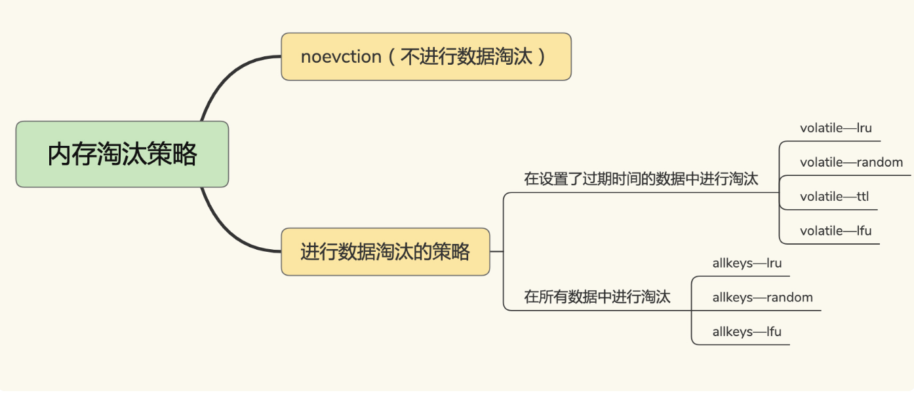
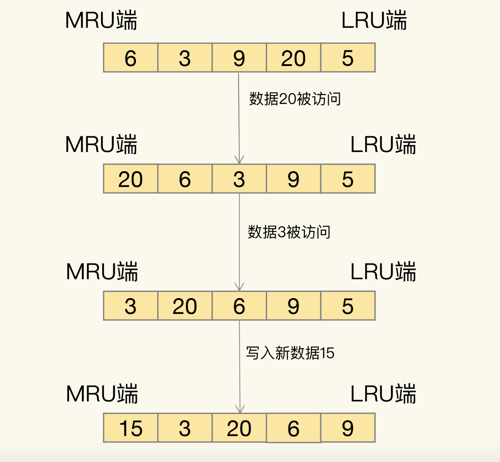

# 10、Redis缓存淘汰策略

##Redis缓存有哪些淘汰策略

Redis提供了8中缓存淘汰策略



在设置了过期时间的数据中淘汰
- volatile-ttl 在筛选时，会针对设置了过期时间的键值对，根据过期时间的先后进行删除，越早过期的越先被删除。
- volatile-random 就像它的名称一样，在设置了过期时间的键值对中，进行随机删除。
- volatile-lru 会使用 LRU 算法筛选设置了过期时间的键值对。
- volatile-lfu 会使用 LFU 算法选择设置了过期时间的键值对。

在所有数据中淘汰
- allkeys-random 策略，从所有键值对中随机选择并删除数据；
- allkeys-lru 策略，使用 LRU 算法在所有数据中进行筛选
- allkeys-lfu 策略，使用 LFU 算法在所有数据中进行筛选。


##LRU算法

概念：LRU 算法的全称是 Least Recently Used，从名字上就可以看出，这是按照最近最少使用的原则来筛选数据，最不常用的数据会被筛选出来，而最近频繁使用的数据会留在缓存中。

过程：LRU会把所有数据组织成一个链表，链表头和和链表尾分别表示MRU端和LRU端，分别表示最近最常使用和最近不常用的数据，当缓存满了或者到达阈值，就将LRU端的数据淘汰。



缺点：LRU算法实现时，需要使用链表管理所有缓存数据，这会带来额外的空间开销。大量的数据访问，会频繁的进行移动链表操作，很耗时，降低了Redis缓存性能。

Redis简化采用方案：Redis默认记录每个数据最近一次访问时间戳(RedisObject中的lru字段记录)，在 redis决定进行淘汰数据时，随机选择N个数据作为候选集，redis会
比较候选集合中lru字段的大小，将最小的字段从缓存中淘汰出去。

这样一来，Redis缓存不用为所有数据维护一个链表，也不用每次访问数据时都移动链表，提升了缓存性能。

建议策略
- 优先使用allkeys-lru策略
- 数据访问频率相差不大，没有冷热数据区分，建议使用allkeys-random策略，随机淘汰即可。
- 置顶需求，可以使用volititle-lru策略，对置顶数据不设置过期时间，其它数据设置过期时间，根据lru策略进行淘汰

##LUR算法实现

```java
public class LRUCache {
    class DLinkedNode {
        int key;
        int value;
        DLinkedNode prev;
        DLinkedNode next;
        public DLinkedNode() {}
        public DLinkedNode(int _key, int _value) {key = _key; value = _value;}
    }

    private Map<Integer, DLinkedNode> cache = new HashMap<Integer, DLinkedNode>();
    private int size;
    private int capacity;
    private DLinkedNode head, tail;

    public LRUCache(int capacity) {
        this.size = 0;
        this.capacity = capacity;
        // 使用伪头部和伪尾部节点
        head = new DLinkedNode();
        tail = new DLinkedNode();
        head.next = tail;
        tail.prev = head;
    }

    public int get(int key) {
        DLinkedNode node = cache.get(key);
        if (node == null) {
            return -1;
        }
        // 如果 key 存在，先通过哈希表定位，再移到头部
        moveToHead(node);
        return node.value;
    }

    public void put(int key, int value) {
        DLinkedNode node = cache.get(key);
        if (node == null) {
            // 如果 key 不存在，创建一个新的节点
            DLinkedNode newNode = new DLinkedNode(key, value);
            // 添加进哈希表
            cache.put(key, newNode);
            // 添加至双向链表的头部
            addToHead(newNode);
            ++size;
            if (size > capacity) {
                // 如果超出容量，删除双向链表的尾部节点
                DLinkedNode tail = removeTail();
                // 删除哈希表中对应的项
                cache.remove(tail.key);
                --size;
            }
        }
        else {
            // 如果 key 存在，先通过哈希表定位，再修改 value，并移到头部
            node.value = value;
            moveToHead(node);
        }
    }

    private void addToHead(DLinkedNode node) {
        node.prev = head;
        node.next = head.next;
        head.next.prev = node;
        head.next = node;
    }

    private void removeNode(DLinkedNode node) {
        node.prev.next = node.next;
        node.next.prev = node.prev;
    }

    private void moveToHead(DLinkedNode node) {
        removeNode(node);
        addToHead(node);
    }

    private DLinkedNode removeTail() {
        DLinkedNode res = tail.prev;
        removeNode(res);
        return res;
    }
}
```


