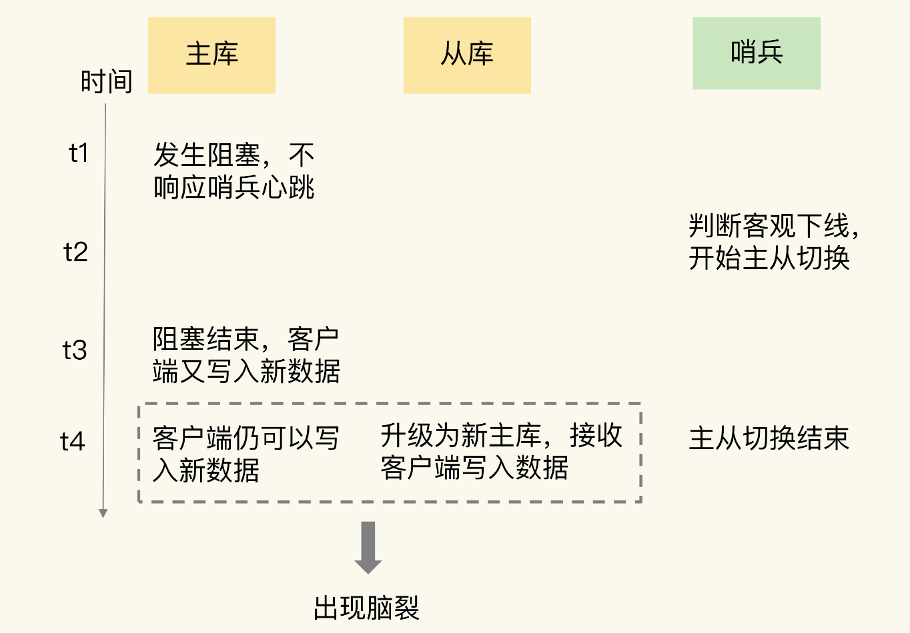
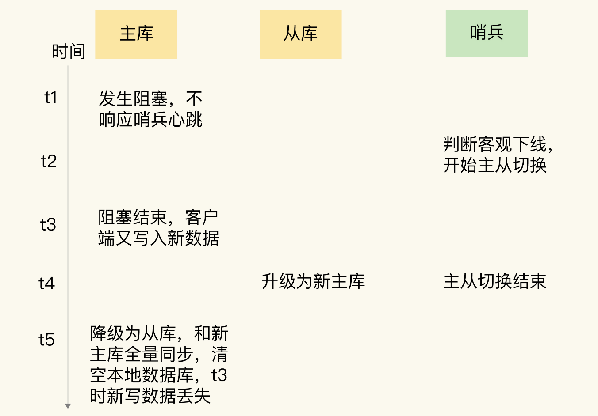

# 14、Redis脑裂

所谓的脑裂，就是指在主从集群中，同时有两个主节点，它们都能接收写请求。而脑裂最直接的影响，就是客户端不知道应该往哪个主节点写入数据，结果就是不同的客户端会往不同的主节点上写入数据。而且，严重的话，脑裂会进一步导致数据丢失。

脑裂经常会发生数据丢失

##为什么会发生脑裂

第一步：确认是不是数据同步出现了问题

主库的数据还没有同步到从库，结果主库发生了故障，等从库升级为主库后，未同步的数据就丢失了。

## 脑裂发生的过程

##为什么脑裂会丢失数据

主从切换后，从库一旦升级为新主库，哨兵就会让原主库执行 slave of 命令，和新主库重新进行全量同步。而在全量同步执行的最后阶段，原主库需要清空本地的数据，加载新主库发送的 RDB 文件，这样一来，原主库在主从切换期间保存的新写数据就丢失了。

##如何应对脑裂问题

- min-slaves-to-write：这个配置项设置了主库能进行数据同步的最少从库数量；
- min-slaves-max-lag：这个配置项设置了主从库间进行数据复制时，从库给主库发送 ACK 消息的最大延迟（以秒为单位）。

##脑裂主库假故障原因
- 和主库部署在同一台服务器上的其他程序临时占用了大量资源（例如 CPU 资源），导致主库资源使用受限，短时间内无法响应心跳。其它程序不再使用资源时，主库又恢复正常。
- 主库自身遇到了阻塞的情况，例如，处理 bigkey 或是发生内存 swap, 短时间内无法响应心跳，等主库阻塞解除后，又恢复正常的请求处理了.

