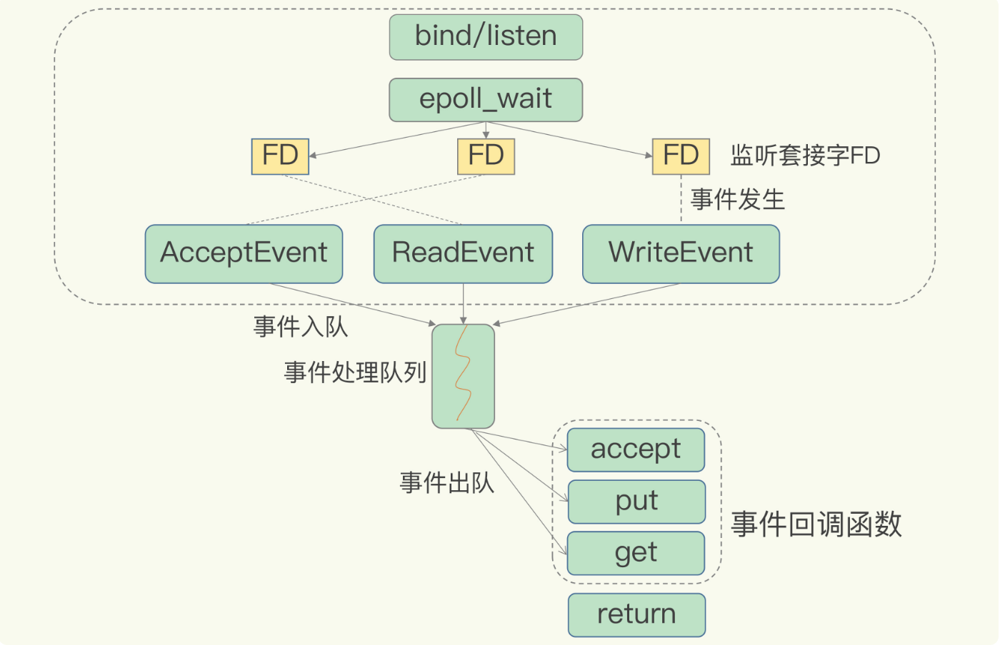

# Redis高性能IO模型

##Redis为什么用单线程，Redis为什么那么快？

使用单线程原因：多线程开销大，涉及到上下文切换，为保证共享资源的正确性，需要额外的锁机制进行保障，带来了额外的开销，这就是多线程编程面临的共享资源并发访问控制问题，为了避免这些问题，Redis直接采用单线程模式。

Redis快的原因：
- 单线程，避免了多线程的上下文切换开锁，共享资源并发控制开销
- Redis大部分操作在内存中完成的
- 高效的数据结构，使用一个全局哈希表，底层数据结构高效，如使用哈希表和跳表。
- 多路复用机制的IO模型

##基于多路复用的高性能I/O模型

**什么是IO多路复用**
I/O多路复用（multiplexing）的本质是通过一种机制（系统内核缓冲I/O数据），让单个进程可以监视多个文件描述符，一旦某个描述符就绪（一般是读就绪或写就绪），能够通知程序进行相应的读写操作

Linux中的IO多路复用机制是指一个线程处理多个IO流，就是我们经常听到的select/epoll机制,简单来说，就是Redis只运行单线程的情况下，该机制允许内核中，同时存在多个监听套接字和已连接套接字。内核会一直监听 这些套接字上的连接请求，或数据请求，一旦有请求到达，就会交给Redis线程处理，就实现了一个Redis线程处理多个IO流的效果。

基于Redis多路复用的IO模型

select/epoll提供基于事件的回调机制，事件放在事件队列里，Redis单线程不断处理事件队列，避免轮询浪费CPU资源。

##总结

Redis单线程是指它对网络IO和数据读写的操作采用一个线程，而采用单线程的一个核心原因是避免多线程开发的并发控制问题。单线程的Redis高性能的原因跟多路复用的IO模型密切相关，因为这避免了accept()和send()/recv()潜在的网络阻塞操作。

##常见面试题

**1、在Redis基本IO模型中，你觉得还潜在哪些性能瓶颈。**

主要是阻塞操作对Redis单线程的性能影响，比如主线程在执行操作，任何耗时的操作，比如bigKey，全量返回等操作(引入的scan操作可以避免)，都是潜在性能瓶颈。

**2、Redis为什么是单线程的，Redis为什么这么快。**

使用单线程原因：多线程开销大，涉及到上下文切换，为保证共享资源的正确性，需要额外的锁机制进行保障，带来了额外的开销，这就是多线程编程面临的共享资源并发访问控制问题，为了避免这些问题，Redis直接采用单线程模式。

Redis快的原因：
- 单线程，避免了多线程的上下文切换开锁，共享资源并发控制开销
- Redis大部分操作在内存中完成的
- 高效的数据结构，使用一个全局哈希表，底层数据结构高效，如使用哈希表和跳表。
- 多路复用机制的IO模型

**3、**

