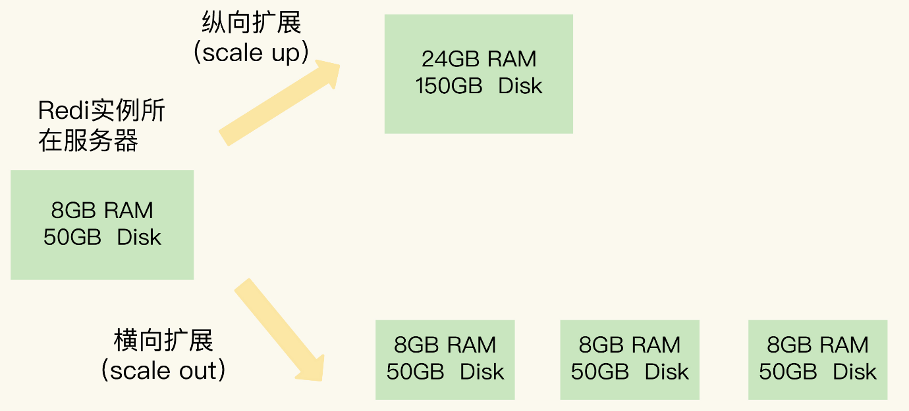
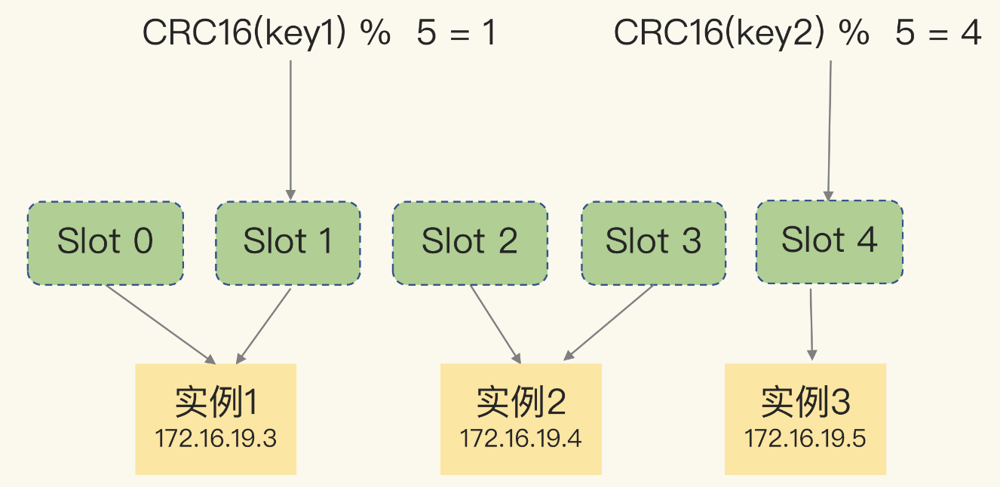

# 7、切片集群

##Redis如何保存更多的数据？
- 纵向扩展：升级单个Redis实例资源，包括内存容量，磁盘容量，CPU等。
- 横向扩展：增加当前Redis实例的个数.

这两种方式的优缺点：

纵向扩展优点：实施简单，直接。
纵向扩展缺点：使用RDB对数据持久化时，数据量的增加，需要的内存也会增加，fork子线程的时候可能会阻塞，纵向扩展会受硬件和成本限制。

横向扩展：
- 数据切片后，在多个实例间如何分布
- 客户端怎么确定想要访问的数据在哪个实例上。

##数据片和实例的对应分布关系

Redis Cluster方案采用哈希槽来处理实例和数据之间的映射关系，方案中，一个切片集群共有16384个哈希槽，类似于数据分区，每个键值都会根据它的key,被映射到一个哈希槽

映射过程：CRC16算法计算一个16bit的值，再用这个16bit的值对16385取模，得到0-16383范围内的数， 分配到对应的哈希槽位置。

