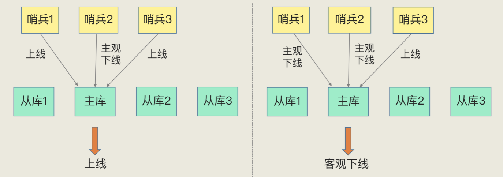

# 6、哨兵机制、哨兵集群

##主库挂了，如何不间断的提供服务

如果主库挂了，客户端读操作还可以由其他从库继续提供服务， 如果是写操作请求，按照读写分离模式，写操作由主库完成，主库挂了，写服务就中断了，也无法进行主从同步工作了。

解决办法：主库挂了，需要运行一个新主库，比如讲一个从库切换为主库，这里存在有三个问题

- 主库真的挂了吗
- 选取哪个从库作为新的主库
- 怎么将新主库信息同步给客户端与其他从库

##哨兵机制的基本流程
哨兵其实就是一个运行在特殊模式的Redis进程，主要负责三个任务：监控、选主、通知

- 监控：哨兵周期性的给所有主从库发送PING命令，检测他们是否仍在运行。如果无响应，哨兵会标记为下线状态，主库无响应，会进行自动切换主库流程。
- 选主：哨兵按照一定规则从多个从库中选择一个从库作为新的主库，然后集群中就有了新的主库。
- 通知：哨兵将新主库信息发给其它从库，让他们执行replicaof命令,和新主库建立连接并进行数据复制，同时哨兵会把新主库连接信息通知给客户端，让客户端将请求发到新主库上。

##主观下线和客观下线

哨兵进程会PING命令检测它与主库、从库的网络连接情况，来判断实例的状态。如果从库响应超时，就标记为主观下线，从库下线，影响不会太大

如果检测的是主库，主库响应超时了，哨兵不能简单的把主库标记为主观下线，因为可能存在误判的情况，主库的切换，后续选主和通知会带来不小的通信开销。

什么原因会导致误判？如果集群网络压力大，网络拥塞，或者主库本身压力大的情况下就可能出现误判。

解决办法：哨兵使用多个实例组成的集群模式进行部署，简称哨兵集群，通过哨兵集群投票决定，少数服从多数原则。

##选主新库规则
首先检查从库的当前在线状态，下线了的从库过滤掉，再判断它之前的网络连接状态，然后总是和旧主库断开连接，就筛选掉。
对接下来的从库进行打分，得分最高的就是新的主库

- 第一轮：优先级最高的从库得最高分(redis 配置项可以配置优先级)
- 第二轮：和旧从库同步程度最接近的从库得分高
- 第三轮：ID号小的从库得分高

##哨兵集群的关键机制
- 基于pub/sub机制的哨兵集群组成过程，哨兵在主库上发布自己的连接信息，也可以从主库上订阅消息，多个哨兵就知道了彼此的链接信息，可以进行通信。
- 哨兵向主库发送INFO命令，主库会把从库列表返回给哨兵，哨兵再与从库建立连接。
- 基于哨兵自身的pub/sub功能，实现了客户端与哨兵直接的事件通知。

##总结

1、通过哨兵机制，可以实现主从库自动切换，主从库切换需要一定时间，这期间能否正常处理客户端请求？如果想要客户端不感知服务中断，还需要哨兵和客户端做什么工作。

一方面，客户端需要能缓存应用发送的写请求。只要不是同步写操作（Redis 应用场景一般也没有同步写），写请求通常不会在应用程序的关键路径上，所以，客户端缓存写请求后，给应用程序返回一个确认就行
主从切换完成后，客户端要能和新主库重新建立连接，哨兵需要提供订阅频道，让客户端能够订阅到新主库的信息。同时，客户端也需要能主动和哨兵通信，询问新主库的信息。

