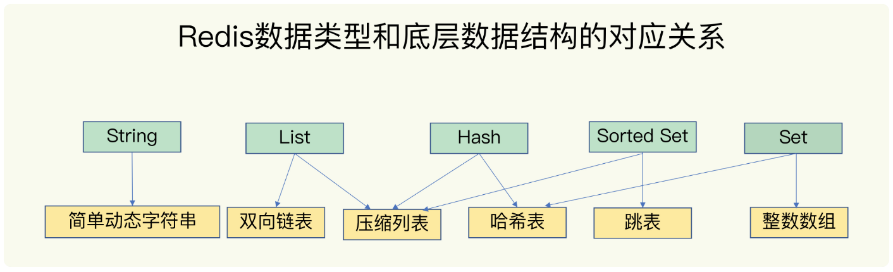

# Redis底层数据结构与实现

Redis底层数据结构一共有六种，分别是动态字符串、双向链表、压缩列表、哈希表、跳表和整形列表。

为了实现从键到值的快速访问，Redis的键和值使用一个哈希表来保存,哈希桶中的entry元素中保存了*key和*value指针，分别指向了实际的键和值。

**潜在的风险点** 为什么哈希表操作变慢了？

原因：哈希表的冲突问题和rehash操作可能带来的操作阻塞。

Redis解决哈希冲突方式：链式哈希，存在的问题，哈希表数据越来越多，哈希冲突越来越多，链表长度过长，查询耗时过长，查询效率变低。

解决办法：Redis对哈希表做rehash操作，rehash也就是增加现在的哈希桶数量，分散元素，减少冲突，减少链表长度。
原始方法：默认保存数据到哈希表1，给哈希表2分配更大的空间，将哈希表1的数据重新映射拷贝到哈希表2，释放哈希表1的空间，会存在的问题：大量的数据拷贝，造成redis线程阻塞。

##渐进式哈希

第二步拷贝数据时，Redis仍正常处理客户端请求，每处理一个请求，从哈希表1中第一个索引的位置开始，将entry拷贝到哈希表2中，下次请求再把索引为2的数据拷贝过去，直到全部拷贝完毕，索引置为-1结束，分摊耗时。

##集合数据的操作效率

查找一个集合类型的值，第一步通过全局哈希表找到哈希桶的位置，第二步在集合中再进行增删改查。

整数数组(O(n))、双向链表(O(n))、哈希表O(1)都比较常见，压缩列表(O(n))和跳表(O(logN))不常见。

**压缩列表**

**跳表**

跳表相当于链表的二分法，通过增加多级索引的方式，通过索引位置的跳转实现数据的快速定位。

不同操作的复杂度，单元素操作指每一种集合类型对单个数据实现增删改查操作，比如Hash类型的HGET、HSET、HDEL，范围操作、比如HGETALL、LRANGE、ZRANGE等，应当尽量避免全量查询语句操作，存在Reids阻塞风险。

如果集合类型采用整数数组、压缩列表、双向链表保存数据，统计元素个数的时间复杂度为O(1)。建议使用SCAN命令

压缩列表和双向链表会记录头尾的偏移量，LPOP、RPOP、LPUSH、RPUSH等操作时间复杂度为O(1);

##Redis底层数据结构与实现常见面试题

1、整数数组和压缩列表在查找时间复杂度方面没有太大优势，为什么Redis还把他们当作底层数据结构呢。

答：Redis之所以使用不同的数据结构，其实是在性能与内存使用效率之间进行平衡。

整数据数组和压缩列表都是在内存中分配一块连续的内存空间，不需要额外的指针将数据串接起来，避免指针带来的额外空间消耗，内存布局非常节省空间。

