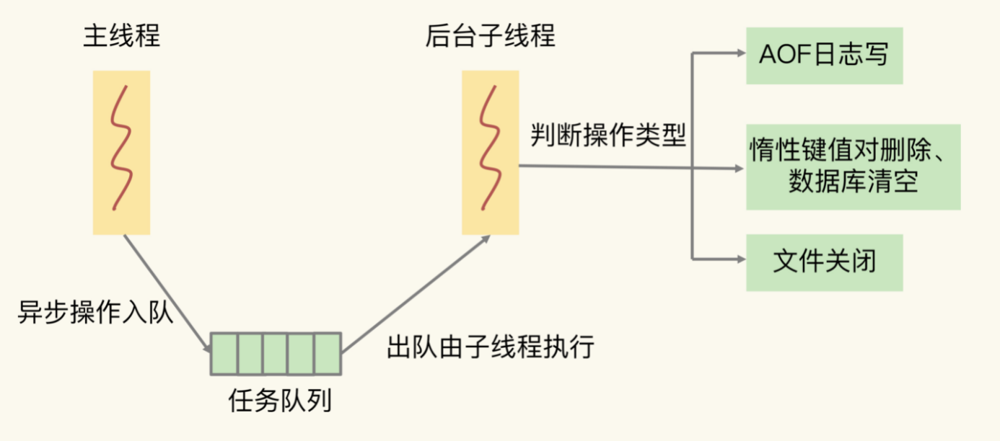

# 8、异步机制：如何避免单线程模型的阻塞

##Rdis实例有哪些阻塞点

- 客户端：网络IO,键值对增删改查操作、数据库操作 
- 磁盘：生成RDB快照、记录AOF日志、AOF日志重写
- 主从节点：主库生成、传输RDB文件、从库接收RDB文件、清空数据库、加载RDB文件
- 切片集群实例：向其他实例传输哈希槽信息、数据迁移。

1、和客户端交互时的阻塞点：集合全量查询和聚合操作、bigKey删除操作、清空数据库。
2、和磁盘交互时的阻塞点：AOF日志同步写
3、主从节点交互时的阻塞点：从库加载RDB文件

##哪些阻塞点可以异步操作
一个操作可以被异步执行，就意味着，它并不是主线程上的关键路径上的操作，结果不需要立即响应给客户端，比如读操作时典型的关键路径上的操作，因为
客户端强依赖返回结果。

对于 Redis 的五大阻塞点来说，除了“集合全量查询和聚合操作”和“从库加载 RDB 文件”，其他三个阻塞点涉及的操作都不在关键路径上，所以，我们可以使用 Redis 的异步子线程机制来实现 bigkey 删除，清空数据库，以及 AOF 日志同步写

##异步的子线程机制

