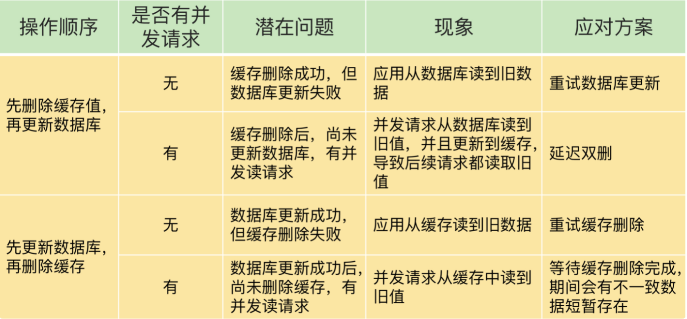

# 11、缓存一致性问题

##如何解决缓存和数据库的数据不一致问题

缓存和数据库数据不一致是如何发生的

缓存一致性概念：缓存中有数据，那么缓存中的数据值需要和数据库中的数据值相同，缓存中本身没有数据,那么数据库中的值必须是最新的值。

##读写缓存
- 同步直写策略：写缓存时，也同步写数据库，缓存和数据库中的数据一致。
- 异步写回策略：写缓存时候不同步写数据库，等到数据从缓存中淘汰时，再写回数据库，使用这种策略时，如果数据还没写回数据库，缓存就发生了故障，那么此时数据库就没有最新数据了。

**使用事物机制，写缓存时同时写数据库，来保证缓存和数据库的更新具有原子性，避免数据不一致问题。**

如果对数据一致性要求不高，比如修改一下非关键性属性，可以使用异步写回策略。

##只读缓存
新增、删除、修改数据，都会直接在数据库中进行操作，删除、修改数据时，还会将缓存中的数据删除，置位无效。

- 新增数据的情况，数据直接写到数据库中，不对缓存做任何操作，缓存中本身没有新增的数据，缓存和数据库的数据是一致的。
- 删改数据的情况，删改数据，需要更新数据库，同时需要在缓存中删除数据，如果两个操作无法保证原子性，就会存在数据不一致的问题。无论先操作缓存还是先操作数据库
只要有一个失败了，就会存在数据不一致问题，和操作顺序无关。
  
##如何解决数据不一致问题

方案一：重试机制，把要删除或者更新的值暂存在消息队列中，比如kafka,当删改失败，从消息队列中重新读取，再进行删改操作，如果删改成功，将消息去除，避免重复操作，如果失败
进行重试，重试一定次数还是失败，将错误信息抛出给业务层，记录错误日志，后续进行数据恢复。

**情况一：先删除缓存、再更新数据库*


解决办法：延迟双删
```
redis.delKey(x)
db.update(x)
Thread.sleep(n)
redis.delKey(x)
```

情况二：先更新数据库值，再删除缓存值


解决方案：
- 删除缓存值或更新数据库失败而导致数据不一致，你可以使用重试机制确保删除或更新操作成功
- 在删除缓存值、更新数据库的这两步操作中，有其他线程的并发读操作，导致其他线程读取到旧值，应对方案是延迟双删

##小结


建议使用优先删除数据库，再删除缓存的方法；
- 先删除缓存再更新数据库，有可能导致瞬间访问数据库的量太大，导致数据库压力过大。


