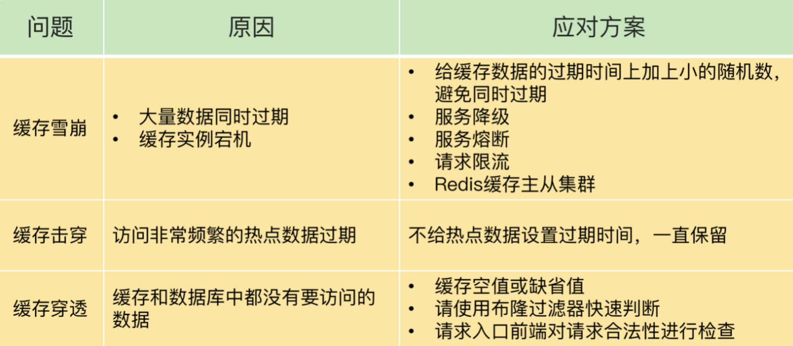

# 12、缓存雪崩、缓存击穿、缓存穿透问题

#缓存雪崩

概念：缓存雪崩是指大量的应用请求无法在 Redis 缓存中进行处理，紧接着，应用将大量请求发送到数据库层，导致数据库层的压力激增。

导致缓存雪崩的原因：

第一个原因：缓存中有大量的数据同时过期，导致大量请求无法得到处理。

解决方案：

- 微调过期时间，设置过期时间时，给这些数据的过期时候增加一个较小的随机数，可以避免大量数据同一时间过期，也保证了这些数据基本在相近的过期时间内。
- 服务降级： 当访问的是非核心数据时，比如评论、商品属性、暂停从缓存中查询这些数据，而是直接返回预定义的值或者错误信息，不去请求redis，如果访问的是
核心数据时，比如商品库存，仍然允许查询缓存，缓存缺失，也可以通过数据库进行查询。
  
第二个原因：Redis缓存实例发生宕机了，无法处理请求，所有请求都打到了数据库上，发生缓存雪崩。

解决方案：
- 在业务系统中实现服务熔断或者请求限流机制。暂停数据库请求访问缓存和数据库，等实例恢复服务后，再允许将请求发送到缓存。
- 请求限流：比如设置每秒请求量最多为1000，大于1000的请求直接拒绝服务，比如提示网络繁忙，请稍后重试。
- 事前预防：构建redis高可靠集群，主节点宕机，进行主从切换。

#缓存击穿

概念：缓存击穿是指，针对某个访问非常频繁的热点数据的请求，无法在缓存中进行处理，紧接着，访问该数据的大量请求，一下子都发送到了后端数据库，导致了数据库压力激增，会影响数据库处理其他请求。缓存击穿的情况，经常发生在热点数据过期失效时。

解决办法：对于访问特别频繁的热点数据，就不设置过期时间了。

#缓存穿透

概念：缓存穿透是指要访问的数据既不在 Redis 缓存中，也不在数据库中，导致请求在访问缓存时，发生缓存缺失，再去访问数据库时，发现数据库中也没有要访问的数据。此时，应用也无法从数据库中读取数据再写入缓存，来服务后续请求，这样一来，缓存也就成了“摆设”，如果应用持续有大量请求访问数据，就会同时给缓存和数据库带来巨大压力。

缓存穿透发生的场景

- 业务层操作错误，缓存中的数据和数据库中的数据被误删除了，所以缓存中和数据库中没有数据。
- 恶意攻击,专门访问数据库中没有的数据。

解决方案：
- 缓存空值或者缺省值，一旦发生缓存穿透 ，针对查询的数据，我们可以在redis中缓存一个空值或者缺省值，后续操作读取空值或者缺省值。
- 使用布隆过滤器快速判断数据是否存在，避免从数据库中查询数据是否存在，减轻数据库压力。
- 前端进行请求检测，拦截掉恶意请求。

##小结

事前预防，使用预安，服务熔断、服务降低、服务限流都对业务系统存在一定的影响，影响用户体验。

- 针对缓存雪崩、合理设置数据过期时间、搭建高可用缓存集群。
- 针对缓存击穿、在缓存访问非常频繁的热点数据时、不设置数据过期时间。
- 针对缓存穿透、提前在入口前端做好充分的恶意请求检测、拦截恶意请求，规范数据库的删除操作、避免出现误操作。

