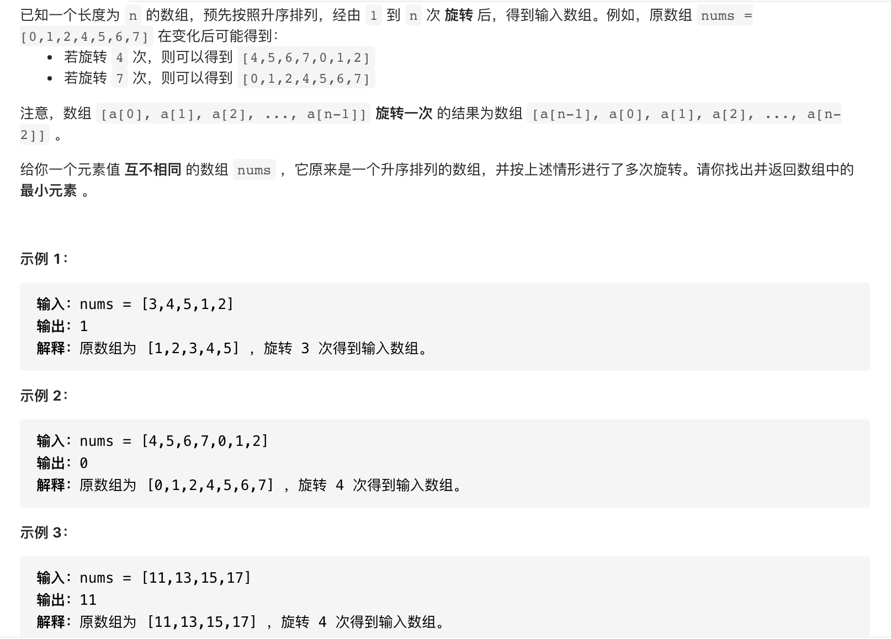

#  **题目描述（中等难度）**

> **[warning] [153. 寻找旋转排序数组中的最小值](https://leetcode-cn.com/problems/find-minimum-in-rotated-sorted-array/)**



#解法一： 暴力
```java
class Solution {
    public int findMin(int[] nums) {
     if(nums.length == 0 || null == nums){
         return -1;
     }   
     Arrays.sort(nums);
     return nums[0];
    }
}
```
暴力求最小值 
```java
class Solution {
    public int findMin(int[] nums) {
       Integer min = Integer.MAX_VALUE;
      for(int i=0;i<nums.length;i++){
       min = Math.min(nums[i],min);
      }
      return min;
    }
}
```
以上方式时间复杂度太差，不推荐

#解法二： 二分法

```java
class Solution {
    public int findMin(int[] nums) {
     int l = 0;
     int r = nums.length-1;
     while(l < r){
         int middle = l + (r-l)/2;
         if(nums[middle] > nums[nums.length-1]){
             l = middle+1;
         }
         else{
             r = middle;
         }
     }
     return nums[l];

    }
}
```

