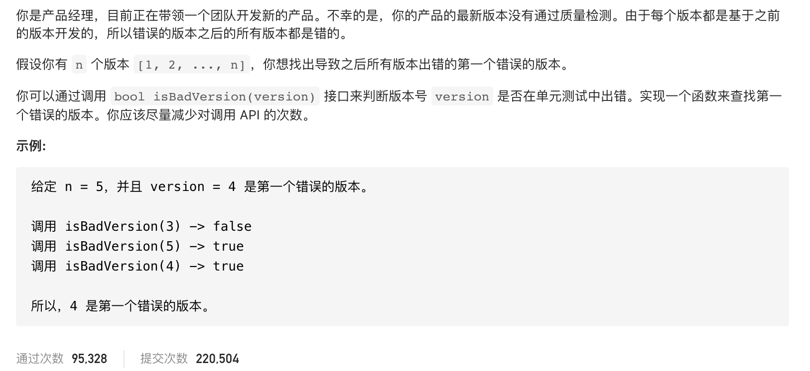

#  **题目描述（简单难度）**

> **[success] [278. 第一个错误的版本](https://leetcode-cn.com/problems/first-bad-version/)**



#解法一：二分法
```java
public class Solution extends VersionControl {

    public int firstBadVersion(int n) {
        int low = 0;
        int high = n;
        int res = -1;
        while(low<=high){
            int middle = low + (high-low)/2;
            if(!isBadVersion(middle)){
               low = middle+1;
            }
           else{
               high = middle-1;
               res = middle;
            }
        }
        return res;
    }
}
```

#解法二： 暴力 超时

```java
public class Solution extends VersionControl {

    public int firstBadVersion(int n) {
      for(int i=0;i<n;i++){
          if(isBadVersion(i)){
              retun i;
          }
      }
      return n;
    }
}
```

