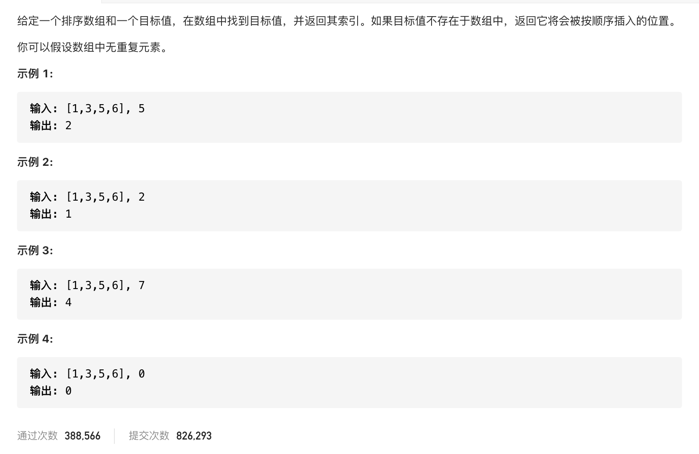

#  **题目描述（简单难度）**

> **[success] [35. 搜索插入位置](https://leetcode-cn.com/problems/search-insert-position/)**



#解法一：二分法+递归

思路：如果二分法查到到了直接返回，如果没查到，将目标值加入后进行排序，再次二分法查找。
```java
class Solution {
    public int searchInsert(int[] nums, int target) {
        int low = 0;
        int high = nums.length - 1;
        while (low <= high) {
            int middle = low + (high - low) / 2;
            if (target == nums[middle]) {
                return middle;
            } else if (target > nums[middle]) {
                low = middle + 1;
            } else {
                high = middle - 1;
            }
        }
        nums = Arrays.copyOf(nums, nums.length + 1);
        nums[nums.length - 1] = target;
        Arrays.sort(nums);
        return searchInsert(nums, target);
    }
}
```

#解法二：优化后的二分法
```java
class Solution {
    public int searchInsert(int[] nums, int target) {
        int low = 0;
        int high = nums.length - 1;
        int ans = nums.length;
        while (low <= high) {
            int middle = low + (high - low) / 2;
            if (target <= nums[middle]) {
                ans = middle;
                high = middle-1;
            } else {
                low = middle + 1;
            }
        }
        return ans;
    }
}
```
