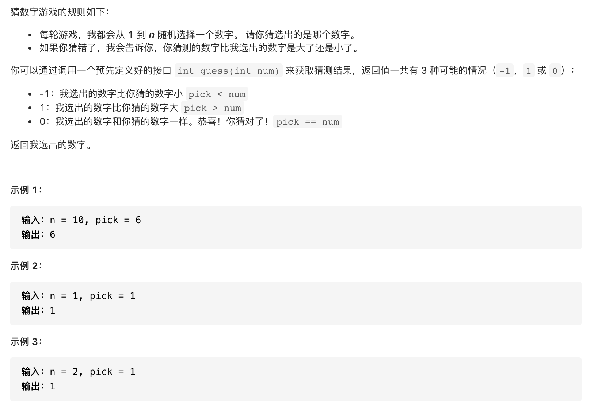

#  **题目描述（简单难度）**

> **[success] [374. 猜数字大小](https://leetcode-cn.com/problems/guess-number-higher-or-lower/)**



#解法一：二分法

```java
public class Solution extends GuessGame {
    public int guessNumber(int n) {
        int low = 0;
        int high = n;
        while(low<=high){
            int middle = low + (high-low)/2;
            if(guess(middle) ==0){
                return middle;
            }
            else if(guess(middle) == 1){
                low = middle+1;
            }
            else{
                high = middle-1;
            }
        }
        return -1;
    }
}
```


