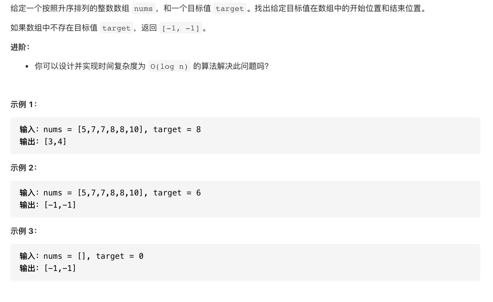

#  **题目描述（困难难度）**

> **[warning] [34. 在排序数组中查找元素的第一个和最后一个位置](https://leetcode-cn.com/problems/find-first-and-last-position-of-element-in-sorted-array/)**



#解法一：暴力
合并数组后排序，再通过二分得出中位数，不符合时间复杂度要求。
```java
class Solution {
    public  double findMedianSortedArrays(int[] nums1, int[] nums2) {
        int begin = nums1.length;
        nums1 = Arrays.copyOf(nums1, nums1.length + nums2.length);
        System.arraycopy(nums2,0,nums1,begin,nums2.length);
        Arrays.sort(nums1);
        int l = 0;
        int r = nums1.length-1;
        int middle = l + (r-l)/2;
        if(nums1.length %2 == 0){
            return (nums1[middle]+nums1[middle+1])/2.0;

        }
        else{
            return nums1[middle]/1.0;
        }
    }
}
```


