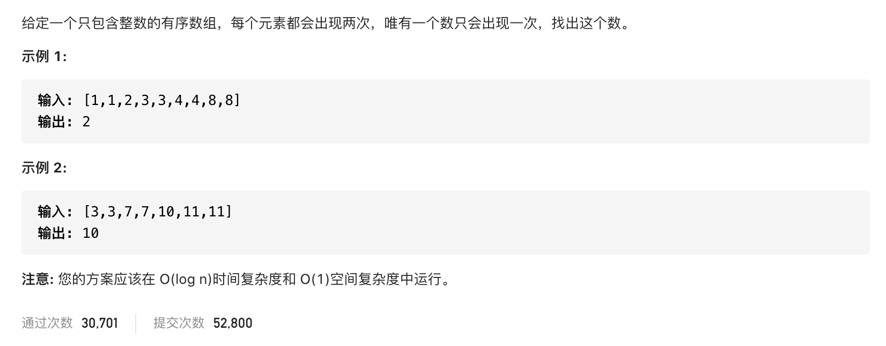

#  **题目描述（中等难度）**

> **[warning] [374. 猜数字大小](https://leetcode-cn.com/problems/guess-number-higher-or-lower/)**



#解法一： 暴力法
```java
class Solution {
    public int singleNonDuplicate(int[] nums) {
     Map<Integer,Integer> map = new HashMap<>();
     for(int i=0;i<nums.length;i++){
         map.put(nums[i],map.getOrDefault(nums[i],0)+1);
     }
     
     for(Map.Entry<Integer,Integer> maps : map.entrySet()){
         if(maps.getValue() == 1){
             return maps.getKey();
         }
     }
     return -1;
    }
}
```

优化后的暴力
```java
class Solution {
    public int singleNonDuplicate(int[] nums) {
      for(int i=0;i<nums.length-2;i = i+2){
          if(nums[i] != nums[i+1]){
              return nums[i];
          }
      }
      return nums[nums.length-1];
    }
}
```

#解法二： 二分法

```java
class Solution {
    public int singleNonDuplicate(int[] nums) {
      int low = 0;
      int high = nums.length-1;
      while(low <high){
          int middle = low + (high-low)/2;
          if(middle %2 == 1){
              middle --;
          }
          if(nums[middle] == nums[middle+1]){
              low = middle+2;
          }
          else{
              high = middle;
          }
      }
      return nums[low];
    }
}
```


