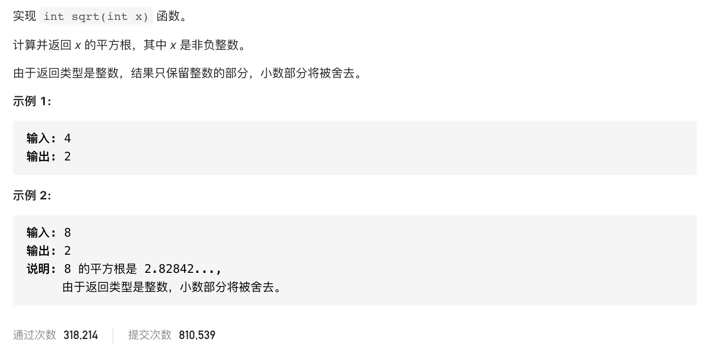

#  **题目描述（简单难度）**

> **[success] [69. x 的平方根](https://leetcode-cn.com/problems/sqrtx/)**



#解法一：二分法
```java
class Solution {
    public int mySqrt(int x) {
      int low = 0;
      int high = x;
      int res = -1;
      while(low<=high){
          int middle = low + (high-low)/2;
          if((long)middle*middle == x){
              return middle;
          }
          else if((long)middle*middle >x){
              high = middle-1;
          }
          else{
              low = middle+1;
              res = middle;
          }
      }
      return  res;
    }
}
```

