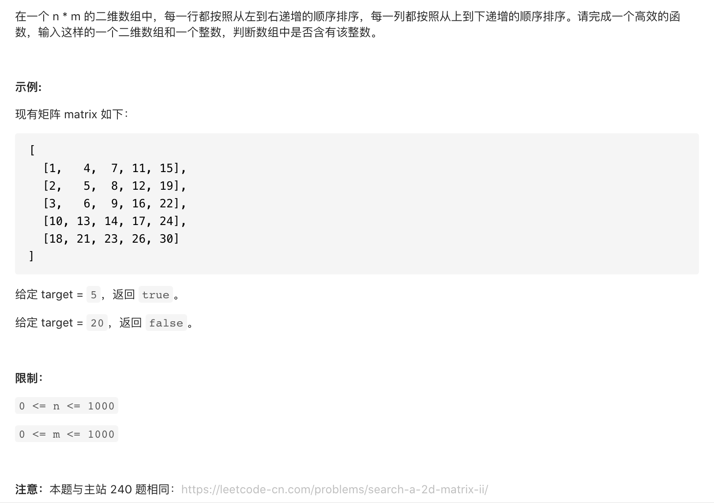

#  **题目描述（中等难度）**

> **[warning] [剑指 Offer 04. 二维数组中的查找](https://leetcode-cn.com/problems/er-wei-shu-zu-zhong-de-cha-zhao-lcof/)**



#解法一：暴力，两个for循环，或者一个循环一个二分
```java
class Solution {
    public boolean findNumberIn2DArray(int[][] matrix, int target) {
      for(int i=0;i<matrix.length;i++){
          int[] ans = matrix[i];
          int low=0;
          int high = ans.length-1;
          while(low <= high){
              int middle = low + (high-low)/2;
              if(ans[middle] == target){
                  return true;
              }
              if(ans[middle] > target){
                  high = middle-1;
              }
              else{
                  low = middle+1;
              }
          }
      }
      return false;
    }
}
```


#解法二： 线性查找 二分法
解题思路
由于给定的二维数组具备每行从左到右递增以及每列从上到下递增的特点，当访问到一个元素时，可以排除数组中的部分元素。

从二维数组的右上角开始查找。如果当前元素等于目标值，则返回 true。如果当前元素大于目标值，则移到左边一列。如果当前元素小于目标值，则移到下边一行。

可以证明这种方法不会错过目标值。如果当前元素大于目标值，说明当前元素的下边的所有元素都一定大于目标值，因此往下查找不可能找到目标值，往左查找可能找到目标值。如果当前元素小于目标值，说明当前元素的左边的所有元素都一定小于目标值，因此往左查找不可能找到目标值，往下查找可能找到目标值。

若数组为空，返回 false
初始化行下标为 0，列下标为二维数组的列数减 1
重复下列步骤，直到行下标或列下标超出边界
获得当前下标位置的元素 num
如果 num 和 target 相等，返回 true
如果 num 大于 target，列下标减 1
如果 num 小于 target，行下标加 1
循环体执行完毕仍未找到元素等于 target ，说明不存在这样的元素，返回 false`
```java
class Solution {
    public boolean findNumberIn2DArray(int[][] matrix, int target) {
      if(matrix == null || matrix.length == 0){
          return false;
      }
      int rows = matrix.length;
      int columns = matrix[0].length;
      int row = 0;
      int col = columns-1;
      while(row < rows && col >=0){
          if(matrix[row][col]  == target){
              return true;
          }
          if(matrix[row][col] > target){
              col--;
          }
          else{
              row++;
          }
      }
      return false;
    }
}
```

