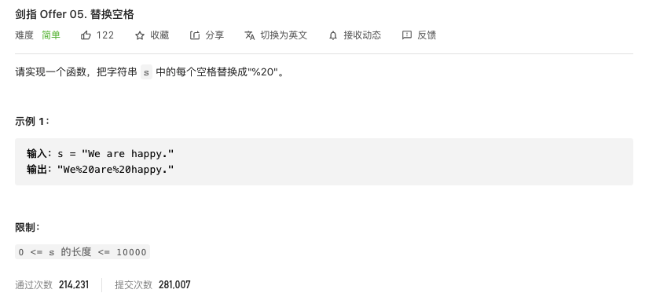

#  **题目描述（简单难度）**

> **[warning] [剑指 Offer 05. 替换空格](https://leetcode-cn.com/problems/ti-huan-kong-ge-lcof/)**



#解法一：遍历替换
```java
class Solution {
    public String replaceSpace(String s) { 
     StringBuilder sb = new StringBuilder();
     for(int i=0;i<s.length();i++){
         if(s.charAt(i) == ' '){
           sb.append("%20");
         }
         else{
             sb.append(s.charAt(i));
         }
     }
     return sb.toString();
    }
}
```

#解法二：使用库函数

```java
class Solution {
    public String replaceSpace(String s) { 
     return s.replace(" ","%20");
    }
}
```

#解法三：字符数组方式

```java
class Solution {
    public String replaceSpace(String s) { 
     char[] array = new char[s.length()*3];
     int size = 0;
     for(int i=0;i<s.length();i++){
         if(s.charAt(i) == ' '){
             array[size++] = '%';
             array[size++] = '2';
             array[size++] = '0';
         }
         else{
             array[size++] = s.charAt(i);
         }
     }
     return new String(array,0,size);
    }
}
```


