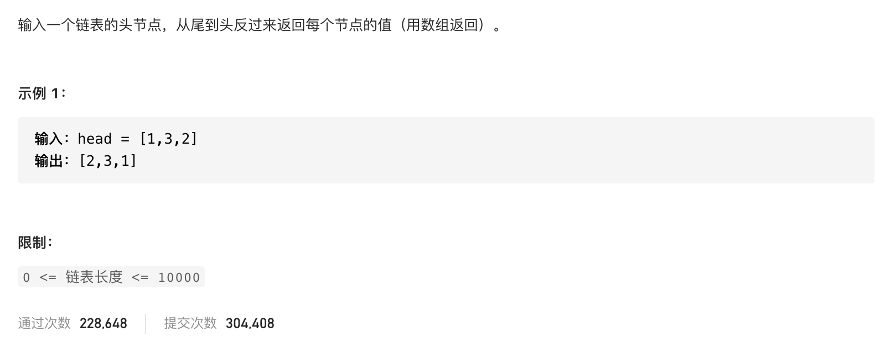

#  **题目描述（简单难度）**

> **[success] [剑指 Offer 06. 从尾到头打印链表](https://leetcode-cn.com/problems/cong-wei-dao-tou-da-yin-lian-biao-lcof/)**



#解法一：先反转链表再输出

```java
class Solution {
    public int[] reversePrint(ListNode head) {
     if(head == null){
         return new int[0];
     }
     List<Integer> list = new ArrayList<>();
     ListNode prev = null;
     ListNode curr = head;
     ListNode temp = null;
     while(curr != null){
         temp = curr.next;
         curr.next = prev;
         prev = curr;
         curr = temp;
     }
     
     while(prev != null){
         list.add(prev.val);
         prev = prev.next;
     }

     int[] result = new int[list.size()];
     for(int i=0;i<list.size();i++){
        result[i] = list.get(i);
     }
     return result;

    }
}
```

#解法二： 从数组最后一位开始输入
```java
class Solution {
    public int[] reversePrint(ListNode head) {
      if(null == head){
          return new int[0];
      }
      ListNode node = head;
      int size = 0;
      while(node != null){
          node = node.next;
          size++;
      }
      int[] res = new int[size];
      node = head;
      for(int i=size-1;i>=0;i--){
          res[i] = node.val;
          node = node.next;
      }
      return res;
    }
}
```

#解法三： 栈
```java
class Solution {
    public int[] reversePrint(ListNode head) {
      Deque<Integer> deque = new ArrayDeque<>();
      ListNode curr = head;
      while(curr != null){
          deque.offerLast(curr.val);
          curr = curr.next;
      }
      int size = deque.size();
      int[] res = new int[size];
      for(int i=0;i<size;i++){
          res[i] = deque.pollLast();
      }
      return res;
    }
}
```


