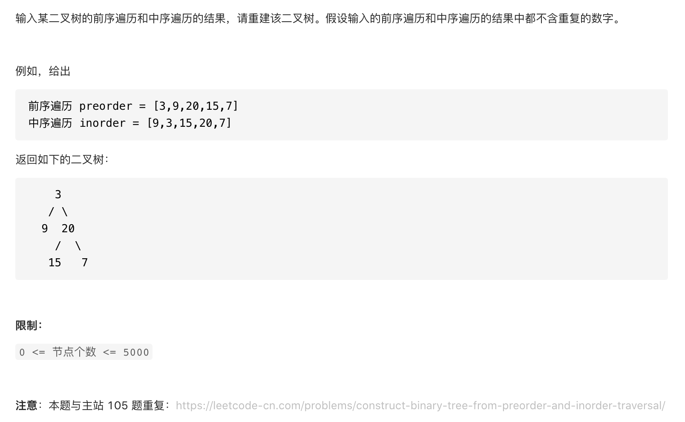

#  **题目描述（中等难度）**

> **[success] [剑指 Offer 07. 重建二叉树](https://leetcode-cn.com/problems/zhong-jian-er-cha-shu-lcof/)**



#解法一：
```java

class Solution {
    Map<Integer,Integer> map = new HashMap<>();
    public TreeNode buildTree(int[] preorder, int[] inorder) {
      if(preorder.length != inorder.length){
          return null;
      }
      int n = preorder.length;
      for(int i=0;i<inorder.length;i++){
          map.put(inorder[i],i);
      }
      return buildTree(preorder,0,n-1,map,0,n-1);
    }
    public TreeNode buildTree(int[] preorder,int preLeft,int preRight,Map<Integer,Integer> map,int inLeft,int inRight){
     if(preLeft > preRight || inLeft > inRight){
         return null;
     }
     int rootVal = preorder[preLeft];
     int preIndex = map.get(rootVal);
     TreeNode root = new TreeNode(rootVal);
     root.left = buildTree(preorder,preLeft+1,preIndex-inLeft + preLeft,map,inLeft,preIndex-1);
     root.right = buildTree(preorder,preIndex-inLeft + preLeft+1,preRight,map,preIndex+1,inRight);
     return root;
    }
}
```
