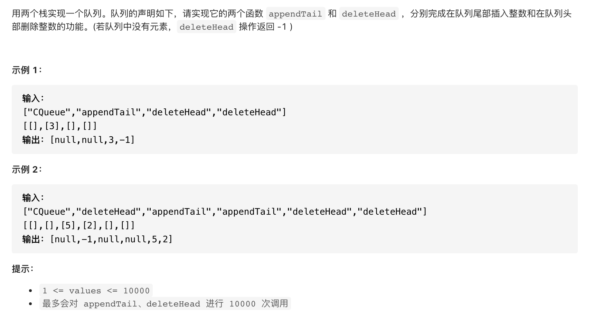

#  **题目描述（中等难度）**

> **[success] [[剑指 Offer 09. 用两个栈实现队列](https://leetcode-cn.com/problems/yong-liang-ge-zhan-shi-xian-dui-lie-lcof/)**



#解法一： 两个栈实现

```java
class CQueue {
    Deque<Integer> A;
    Deque<Integer> B;
    public CQueue() {
      A= new LinkedList<>();
      B= new LinkedList<>();
    }
    
    public void appendTail(int value) {
      A.offerFirst(value);
    }
    
    public int deleteHead() {  
       if(B.isEmpty()){
          while(!A.isEmpty()){
            B.offerFirst(A.pollFirst());
          }
       }
       if(B.isEmpty()){
           return -1;
       }
       return B.pollFirst();
    }
}
```

