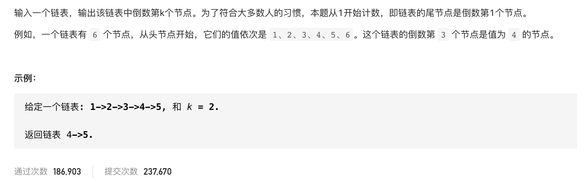

#  **题目描述（中等难度）**

> **[success] [剑指 Offer 22. 链表中倒数第k个节点](https://leetcode-cn.com/problems/lian-biao-zhong-dao-shu-di-kge-jie-dian-lcof/)**



#解法一：遍历链表

遍历链表，统计链表长度n，倒数第k个就是正数第n-k个
```java
class Solution {
    public ListNode getKthFromEnd(ListNode head, int k) {
     if(head == null){
         return null;
     }
     int n = 0;
     ListNode curr = head;
     while(curr != null){
         n++;
         curr = curr.next;
     }
     ListNode temp = head;
     int index = 0;
     while(temp != null){
         if(index == n-k){
             return temp;
         }
         temp = temp.next;
         index++;
     }
     return null;
    }
}
```


