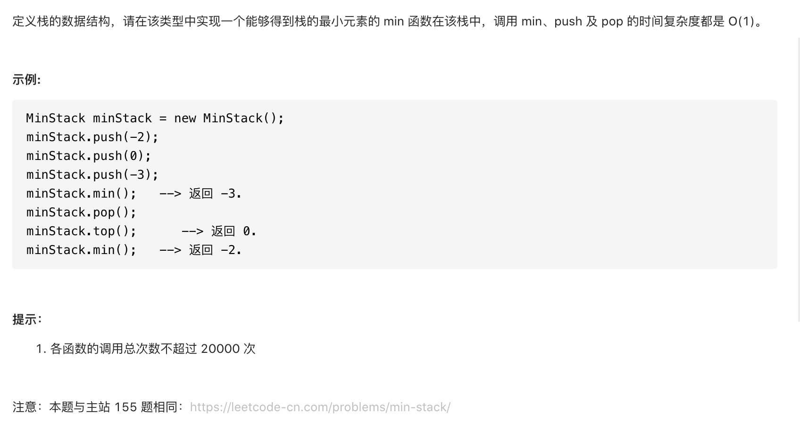

#  **题目描述（中等难度）**

> **[success] [剑指 Offer 30. 包含min函数的栈](https://leetcode-cn.com/problems/bao-han-minhan-shu-de-zhan-lcof/)**



#解法一：优先队列与栈实现

```java
class MinStack {

    PriorityQueue<Integer> priority;
    Deque<Integer> queue;
    /** initialize your data structure here. */
    public MinStack() {
        queue = new LinkedList<Integer>();
        priority = new PriorityQueue<Integer>();
    }

    public void push(int x) {
        queue.offerFirst(x);
        priority.offer(x);
    }

    public void pop() {
        if(!queue.isEmpty()){
            priority.remove(queue.peekFirst());
            queue.pollFirst();
        }
    }

    public int top() {
        if(!queue.isEmpty()){
            return queue.peekFirst();
        }
        return -1;
    }

    public int min() {
        if(!priority.isEmpty()){
            return priority.peek();
        }
        return -1;
    }
}
```

#解法二：使用辅助栈实现

```java
class MinStack {

    Deque<Integer> A;
    Deque<Integer> B;
    public MinStack() {
        A = new LinkedList<>();
        B = new LinkedList<>();
    }

    public void push(int x) {
        A.offerFirst(x);
        if(B.isEmpty() || B.peekFirst() >= x){
            B.offerFirst(x);
        }
        else{
            B.offerFirst(B.peekFirst());
        }
    }

    public void pop() {
        if(!A.isEmpty()){
            A.pollFirst();
            B.pollFirst();
        }
    }

    public int top() {
        if(!A.isEmpty()){
            return A.peekFirst();
        }
        return -1;
    }

    public int min() {
        if(!B.isEmpty()){
            return B.peekFirst();
        }
        return -1;
    }
}
```


