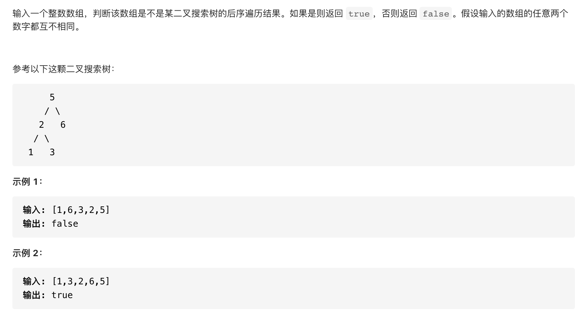

#  **题目描述（中等难度）**

> **[success] [剑指 Offer 33. 二叉搜索树的后序遍历序列](https://leetcode-cn.com/problems/er-cha-sou-suo-shu-de-hou-xu-bian-li-xu-lie-lcof/)**



#解法一：递归分治

划分左右子树： 遍历后序遍历的 [i,j] 区间元素，寻找 第一个大于根节点 的节点，索引记为 m 。此时，可划分出左子树区间 [i,m−1] 、右子树区间 [m, j - 1] 、根节点索引 j 。

```java
class Solution {
    public boolean verifyPostorder(int[] postorder) {
      if(postorder.length < 2){
          return true;
      }
      return verify(postorder,0,postorder.length-1);
    }

    //递归实现
    public boolean verify(int[] postorder,int left,int right){
       //当前区域不合法的时候直接返回true 
       if(left >=right){
           return true;
       }
       //当前树的根节点的值
      int root = postorder[right];
      int m = left;
      //当前区域第一个大于根节点的，说明后续区域的值都是右子树的节点
      for(int i=left;i<right;i++){
          if(postorder[i] <= root){
              m++;
          }
      }
      //校验右子树，左子树已经都小于跟节点了，所以不需要校验
      for(int i=m;i<right;i++){
        if(postorder[i] < root){
            return false;
        }
      }
      //检查左子树
      if(!verify(postorder,left,m-1)){
         return false;
      }
      //检查右子树
      if(!verify(postorder,m,right-1)){
         return false;
      }
      return true;  
    }
}
```

#解法二：单调栈


