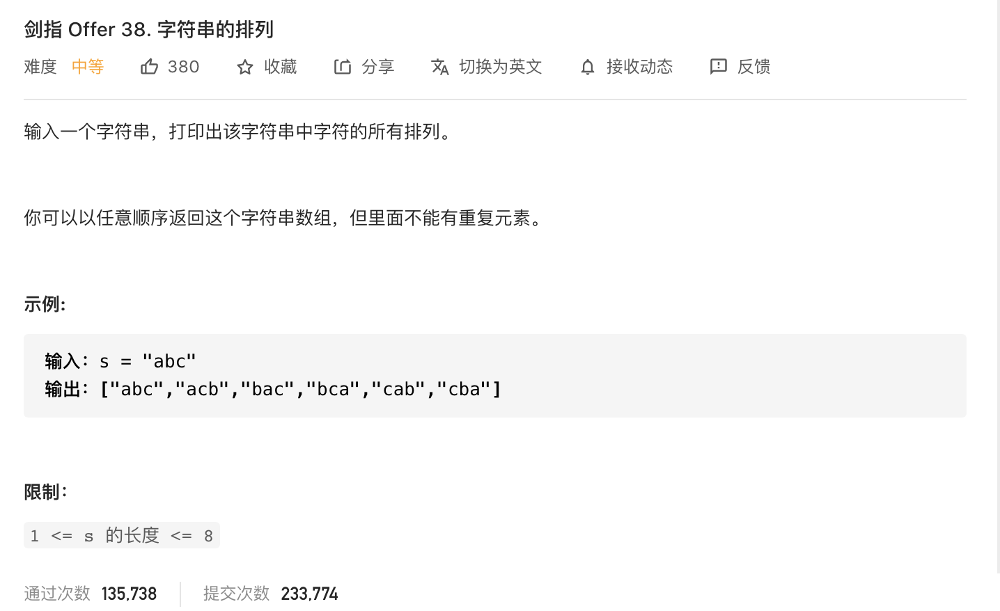

#  **题目描述（简单难度）**

> **[warning] [剑指 Offer 38. 字符串的排列](https://leetcode-cn.com/problems/zi-fu-chuan-de-pai-lie-lcof/)**



#解法一： 回溯

注意题目，字符串可以有重复字符，如果字符串没有重复字符，就不需要做去重校验了，有重复字符，使用一个boolean 数组做去重校验。

```java
class Solution {
    Set<String> set = new HashSet<>();
    StringBuilder sb = new StringBuilder();
    public String[] permutation(String s) {
      if(s.length() == 0 || null == s){
          return new String[0];
      }
      boolean[] used = new boolean[s.length()];
      backtrack(s,used);
      return set.toArray(new String[]{});
    }

    public void backtrack(String s,boolean[] used){
       if(sb.length() == s.length()){
           set.add(sb.toString());
           return;
       }
       for(int i=0;i<s.length();i++){
           if(used[i]){
               continue;
           }
           used[i] = true;
           sb.append(s.charAt(i));
           backtrack(s,used);
           used[i] = false;
           sb.deleteCharAt(sb.length()-1);
       }
    }
}
```
