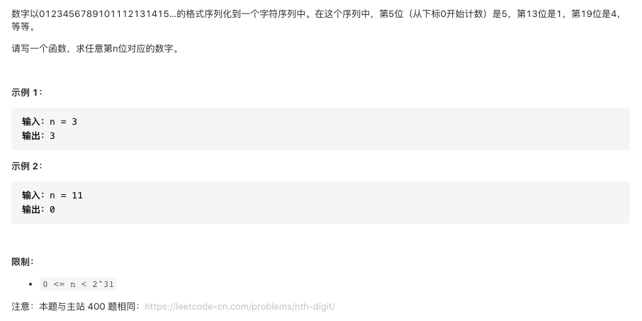

#  **题目描述（简单难度）**

> **[warning] [剑指 Offer 44. 数字序列中某一位的数字](https://leetcode-cn.com/problems/shu-zi-xu-lie-zhong-mou-yi-wei-de-shu-zi-lcof/)**



#解法一：暴力 超出内存限制

```java
class Solution {
    public int findNthDigit(int n) {
      StringBuilder sb = new StringBuilder();
      for(int i=0;i<=n;i++){
          sb.append(String.valueOf(i));
      }
      return sb.toString().charAt(n)-'0';
    }
}
```

#解法二：二分法
```java

```

