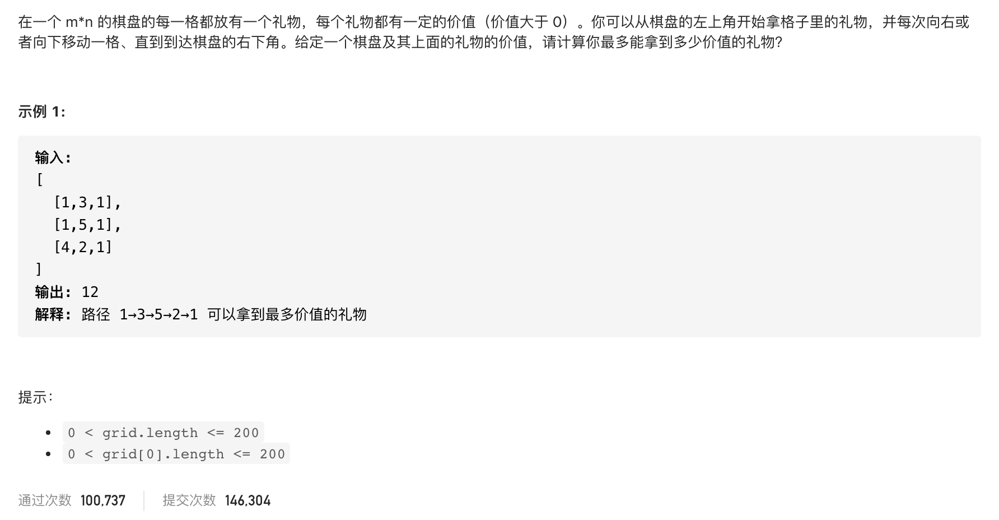

#  **题目描述（简单难度）**

> **[warning] [剑指 Offer 47. 礼物的最大价值](https://leetcode-cn.com/problems/li-wu-de-zui-da-jie-zhi-lcof/)**



#解法一：动态规划
```java
class Solution {
    public int maxValue(int[][] grid) {
        if(grid == null || grid.length == 0){
            return 0;
        }
        int m = grid.length;
        int n = grid[0].length;
        int[][] dp = new int[m][n];
 
        //base case
        dp[0][0] = grid[0][0];
        for(int i=1;i<m;i++){
            dp[i][0] =dp[i-1][0] + grid[i][0];
        }
        for(int j=1;j<n;j++){
            dp[0][j] =dp[0][j-1]+ grid[0][j];
        }
        for(int i=1;i<m;i++){
            for(int j=1;j<n;j++){
                dp[i][j] = Math.max(dp[i][j-1],dp[i-1][j]) + grid[i][j];
            }
        }
        return dp[m-1][n-1];
    }
}
```

#简化代码 ，动态规划
```java
class Solution {
    public int maxValue(int[][] grid) {
        if(grid == null || grid.length == 0){
            return 0;
        }
        int m = grid.length;
        int n = grid[0].length;
        int[][] dp = new int[m+1][n+1];
        for(int i=1;i<=m;i++){
            for(int j=1;j<=n;j++){
              dp[i][j] = Math.max(dp[i][j-1],dp[i-1][j]) + grid[i-1][j-1];
            }
        }
        return dp[m][n];
    }
}
```


