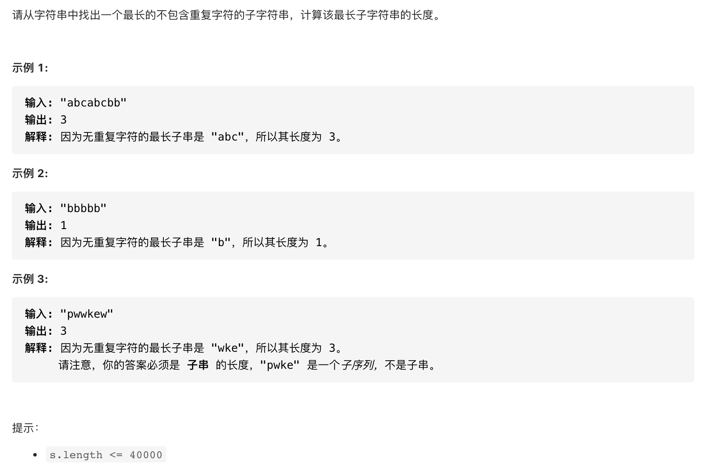

#  **题目描述（简单难度）**

> **[warning] [剑指 Offer 48. 最长不含重复字符的子字符串](https://leetcode-cn.com/problems/zui-chang-bu-han-zhong-fu-zi-fu-de-zi-zi-fu-chuan-lcof/)**



#解法一：滑动窗口
```java
class Solution {
    public int lengthOfLongestSubstring(String s) {
        if(s.length() == 0 || s == null){
            return 0;
        }
        if(s.length() == 1){
            return 1;
        }
        int l = 0;
        int r = l+1;
        int max = Integer.MIN_VALUE;
        Set<Character> set = new HashSet<>();
        while(l<=r && r<s.length()){
            set.add(s.charAt(l));
            if(!set.contains(s.charAt(r))){
                set.add(s.charAt(r));
                r++;
            }
            else{
                max = Math.max(max,set.size());
                set = new HashSet<>();
                l++;
                r = l+1;
            }
            max = Math.max(max,set.size());
        }
        return max;
    }
}
```

#滑动窗口 优化
```java
class Solution {
    public int lengthOfLongestSubstring(String s) {
        if(s.length() == 0 || s == null){
            return 0;
        }
        int l = 0;
        int r = 0 ;
        int max = 0;
        int n = s.length();
        Set<Character> set = new HashSet<>();
        while(l< n && r<n){
            if(!set.contains(s.charAt(r))){
                set.add(s.charAt(r));
                max  = Math.max(max,r-l+1);
                r++;
          
            }
            else{
               set.remove(s.charAt(l));
               l++;
            }
        }
        return max;
    }
}
```

