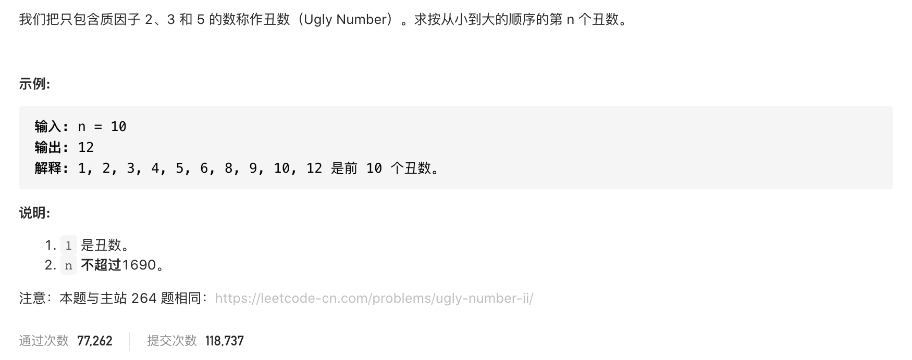

#  **题目描述（简单难度）**

> **[warning] [剑指 Offer 49. 丑数](https://leetcode-cn.com/problems/chou-shu-lcof/)**



#解法一：暴力 超时
```java
class Solution {
    public int nthUglyNumber(int n) {
     List<Integer> list = new ArrayList<>();   
     for(int i=1;i<Integer.MAX_VALUE;i++){
       if(isUgly(i)){
           list.add(i);
       }
       if(list.size() == n){
           return list.get(n-1);
       }
     }
     return -1;
    }

    boolean isUgly(int num) {
        if(num>0){
            for(int i=2;i<=5;i++){
                while(num%i==0){
                    num=num/i;
                }
            }
        }
        return num==1;
    }
}
```

#解法二： 优先队列 最小堆

```java
class Solution {
    public int nthUglyNumber(int n) {
     int[] ans = {2,3,5};
     Set<Long> set = new HashSet<>();
     PriorityQueue<Long> priority = new PriorityQueue<Long>();
     priority.offer(1L);
     set.add(1L);
     int ugly = 0;
     for(int i=0;i<n;i++){
         long curr = priority.poll();
         ugly = (int) curr;
         for(int j=0;j<ans.length;j++){
           if(!set.contains(ans[j]*curr)){
             set.add(ans[j]*curr);
             priority.offer(ans[j]*curr);
           } 
       }  
     }
     return ugly;
    }
}
```

#解法三：动态规划


