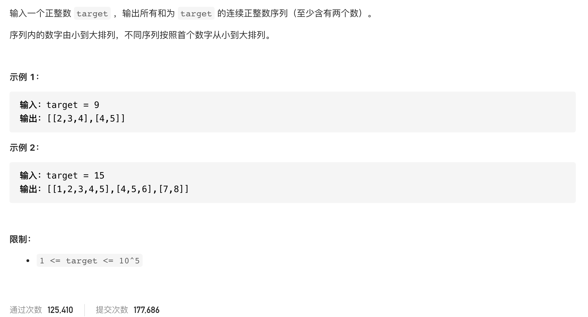

#  **题目描述（简单难度）**

> **[warning] [剑指 Offer 57 - II. 和为s的连续正数序列](https://leetcode-cn.com/problems/he-wei-sde-lian-xu-zheng-shu-xu-lie-lcof/)**



#解法一： 暴力
```java
class Solution {
    public int[][] findContinuousSequence(int target) {
        List<List<Integer>> ans = new ArrayList<>();
        for(int i=1;i<=target/2+1;i++){
            List<Integer> list = new ArrayList<>();
            list.add(i);
            int sum = i;
            for(int j=i+1;j<=target/2+1;){
                sum = sum + j;
                list.add(j);
                if(sum == target){
                    ans.add(list);
                    break;
                }
                if(sum > target){
                    break;
                }
            }
        }

        int[][] resp = new int[ans.size()][];
        for(int i=0;i<ans.size();i++){
            int[] temp = ans.get(i).stream().mapToInt(Integer::valueOf).toArray();
            resp[i] = temp;
        }
       return resp;
    }
}
```

#解法二：双指针 滑动窗口

```java
class Solution {
    public int[][] findContinuousSequence(int target) {
        List<List<Integer>> ans = new ArrayList<>();
        for(int l=1,r=2;l<r;){
            List<Integer> list = new ArrayList<>();
            int sum = ((l+r)*(r-l+1))/2;
            if(sum == target){
                for(int i=l;i<=r;i++){
                  list.add(i);
                }
                ans.add(list);
                l++;
            }
            else if(sum > target){
                l++;
            }
            else{
                r++;
            }
        }

        int[][] resp = new int[ans.size()][];
        for(int i=0;i<ans.size();i++){
            int[] temp = ans.get(i).stream().mapToInt(Integer::valueOf).toArray();
            resp[i] = temp;
        }
       return resp;
    }
}
```

