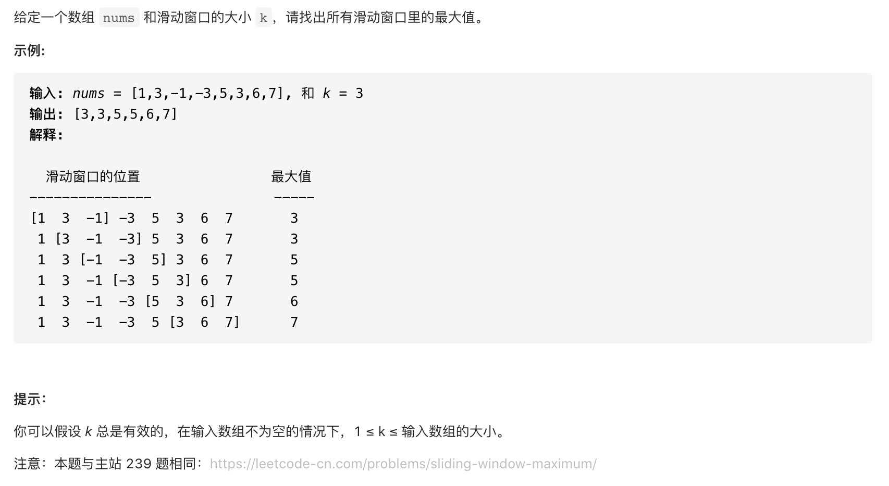

#  **题目描述（简单难度）**

> **[warning]  [剑指 Offer 59 - I. 滑动窗口的最大值](https://leetcode-cn.com/problems/hua-dong-chuang-kou-de-zui-da-zhi-lcof/)**



#解法一：双指针滑动窗口

```java
class Solution {
    public int[] maxSlidingWindow(int[] nums, int k) {
     if(nums.length == 0 || nums == null){
         return new int[0];
     }   
     int i = 0;
     int j = k-1;
     int n = nums.length-1;
     List<Integer> ans = new ArrayList<>();
     while(j<=n){
        int max = Integer.MIN_VALUE;
        for(int l=i;l<=j;l++){
           max = Math.max(max,nums[l]);
        }
        ans.add(max);
        i++;
        j++;
     }
     int[] resp = new int[ans.size()];
     for(int m=0;m<ans.size();m++){
        resp[m] = ans.get(m);
     }
     return resp;
    }
}
```

#解法二：优先队列


