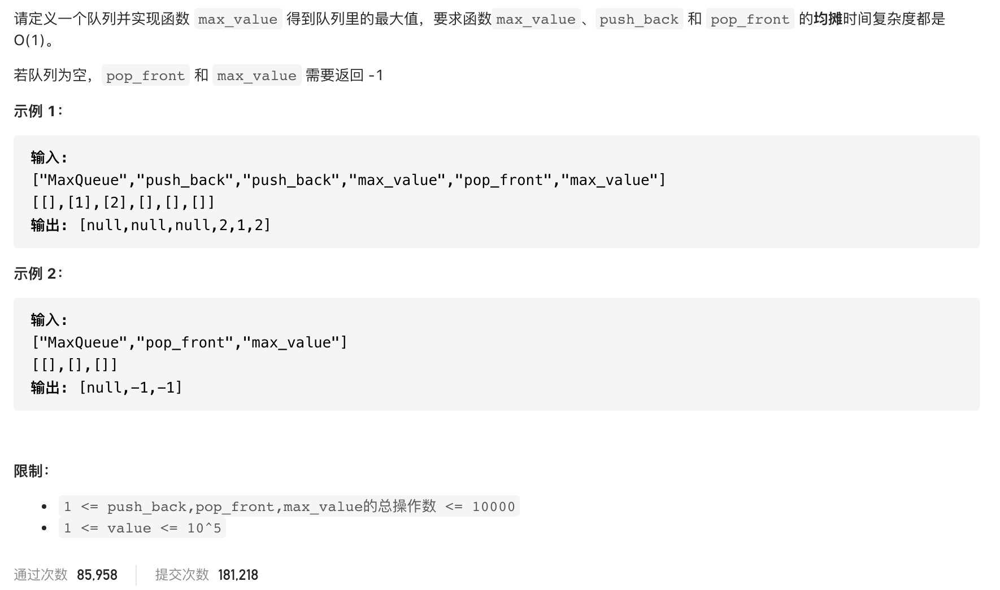

#  **题目描述（简单难度）**

> **[warning]  [剑指 Offer 59 - II. 队列的最大值](https://leetcode-cn.com/problems/dui-lie-de-zui-da-zhi-lcof/)**



#解法一：队列实现

```java
class MaxQueue {
    Deque<Integer> queue;
    Deque<Integer> queue1;
    public MaxQueue() {
      queue = new LinkedList<>();
      queue1 = new LinkedList<>();
    }
    
    public int max_value() {
      if(queue1.isEmpty()){
       return -1;
      }
      return queue1.peekFirst();
    }
    
    public void push_back(int value) {
       queue.offerLast(value);
       while(!queue1.isEmpty() && queue1.peekLast() < value){
           queue1.pollLast();
       }
       queue1.offerLast(value);
      
    }
    
    public int pop_front() {
        if(queue1.isEmpty()){
            return -1;
        }
        if(queue.peekFirst().equals(queue1.peekFirst())){
            queue1.pollFirst();
        }
        return queue.pollFirst();
    }
}
```
