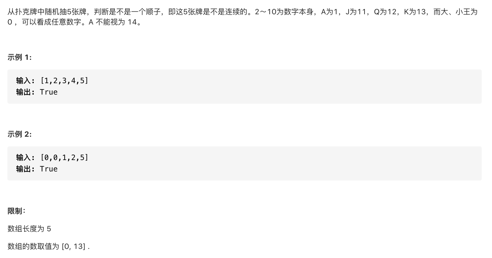

#  **题目描述（简单难度）**

> **[warning] [剑指 Offer 61. 扑克牌中的顺子](https://leetcode-cn.com/problems/bu-ke-pai-zhong-de-shun-zi-lcof/)**



#解法一：集合set + 遍历

```java
class Solution {
    public boolean isStraight(int[] nums) {
       Set<Integer> set = new HashSet<>();
       int min = 14;
       int max = 0;
       for(int i=0;i<nums.length;i++){
           if(nums[i] == 0){
               continue;
           }
           if(set.contains(nums[i])){
               return false;
           }
           min = Math.min(min,nums[i]);
           max = Math.max(max,nums[i]);
            set.add(nums[i]);
       }
       return max - min < 5;
    }
}
```

#解法二： 排序+ 遍历

```java
class Solution {
    public boolean isStraight(int[] nums) {
     Arrays.sort(nums);
     int index = 0;
     for(int i=0;i<nums.length-1;i++){
        if(nums[i] == 0){
           index++;
           continue;
        }
        if(nums[i] == nums[i+1]){
           return false;
        }
     }
     return nums[nums.length-1] - nums[index] < 5; 
    }
}
```


