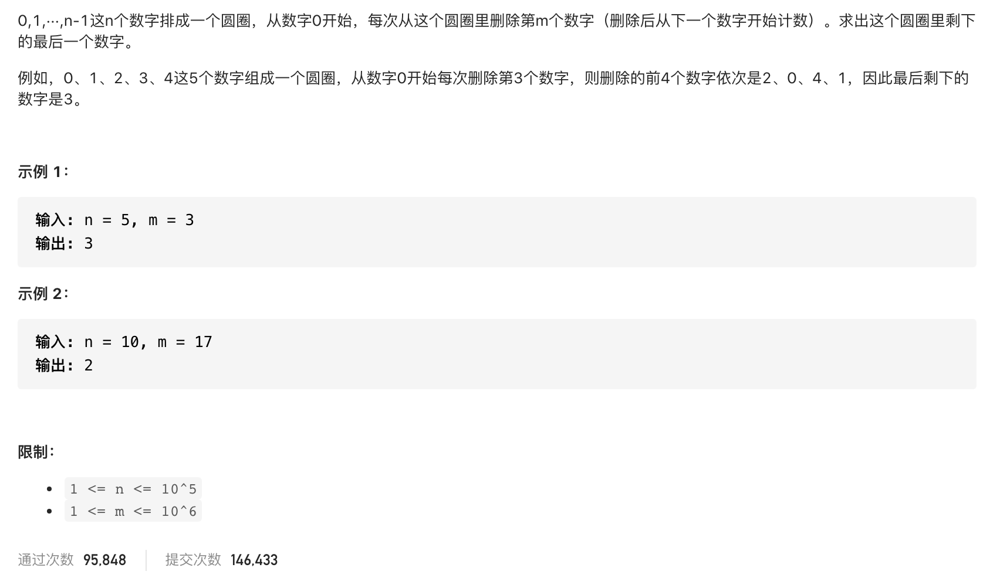

#  **题目描述（中等难度）**

> **[success] [剑指 Offer 62. 圆圈中最后剩下的数字](https://leetcode-cn.com/problems/yuan-quan-zhong-zui-hou-sheng-xia-de-shu-zi-lcof/)**



#解法一：模拟
```java
class Solution {
    public int lastRemaining(int n, int m) {
     List<Integer> ans = new ArrayList<>();   
     for(int i=0;i<n;i++){
        ans.add(i);
     }
     int idx = 0;
     while(n > 1){
         idx = (idx+m-1) % n;
         ans.remove(idx);
         n--;
     }
     return ans.get(0);
    }
}
```

#解法二： 数学法
```java
class Solution {
    public int lastRemaining(int n, int m) {
        int ans = 0;
        // 最后一轮剩下2个人，所以从2开始反推
        for (int i = 2; i <= n; i++) {
            ans = (ans + m) % i;
        }
        return ans;
    }
}
```

