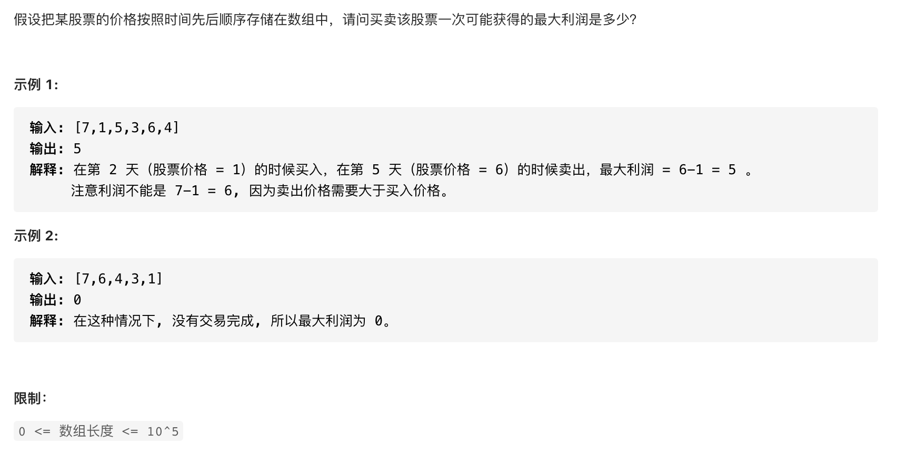

#  **题目描述（中等难度）**

> **[success] [剑指 Offer 63. 股票的最大利润](https://leetcode-cn.com/problems/gu-piao-de-zui-da-li-run-lcof/)**



#解法一：暴力

```java
class Solution {
    public int maxProfit(int[] prices) {
     if(prices == null || prices.length == 0){
         return 0;
     }
     int max = Integer.MIN_VALUE;
     for(int i=0;i<prices.length;i++){
         for(int j=i+1;j<prices.length;j++){
           max = Math.max(max,prices[j]-prices[i]);
         }
     }
     if(max < 0){
         return 0;
     }
     return max;
    }
}
```

#解法二：动态规划

```java
class Solution {
    public int maxProfit(int[] prices) {
     if(prices == null || prices.length == 0){
         return 0;
     }
     int n = prices.length;
     int[] dp = new int[n];
     dp[0] =0;
     //最小入手价
     int cost = prices[0];
     for(int i=1;i<prices.length;i++){
         dp[i] = Math.max(dp[i-1],prices[i]-cost);
         //花费最小价格买入
         cost = Math.min(cost,prices[i]);
     }
     return dp[n-1];
    }
}
```


