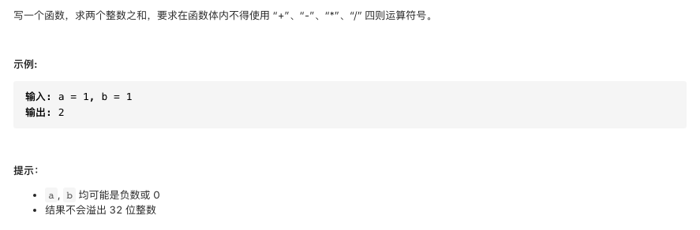

#  **题目描述（简单难度）**

> **[warning] [剑指 Offer 65. 不用加减乘除做加法](https://leetcode-cn.com/problems/bu-yong-jia-jian-cheng-chu-zuo-jia-fa-lcof/)**



#解法一：位运算

```java
class Solution {
    public int add(int a, int b) {
     while(b != 0){
         int c = (a&b)<<1; // c = 进位
         a = a^b; //a = 非进位和
         b = c;  //b = 进位
     }
     return a;
    }
}
```
