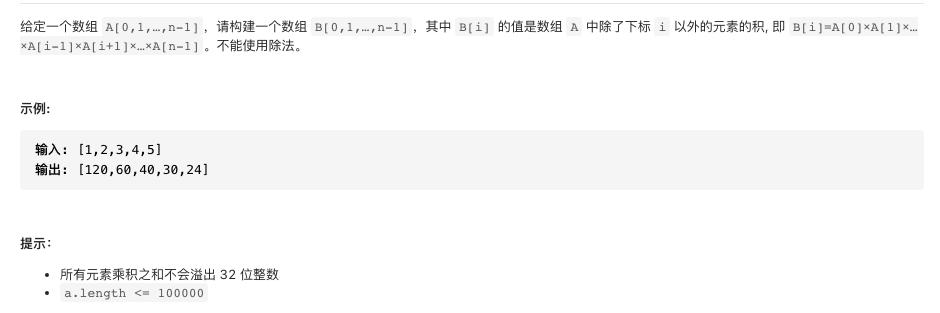

#  **题目描述（简单难度）**

> **[warning] [剑指 Offer 66. 构建乘积数组](https://leetcode-cn.com/problems/gou-jian-cheng-ji-shu-zu-lcof/)**



#解法一：动态规划

如果我们能计算每个元素左边所有元素的乘积和右边所有元素的乘积

只需要把他们相乘就可以满足这题的要求

左边的从左边开始
右边的从右边开始
```java
class Solution {
    public int[] constructArr(int[] a) {
     if(a == null || a.length == 0){
         return new int[0];
     }
     int length = a.length;
     int[] leftDp = new int[length];
     int[] rightDp = new int[length];
     leftDp[0] = 1;
     for(int i=1;i<length;i++){
         leftDp[i] = leftDp[i-1] * a[i-1];
     }

     rightDp[length-1] = 1;
     for(int j= length-2;j>=0;j--){
         rightDp[j] = rightDp[j+1]*a[j+1];
     }

     int[] resp = new int[length];
     for(int i=0;i<length;i++){
         resp[i] = leftDp[i]*rightDp[i];
     }
     return resp;
    }
}
```
