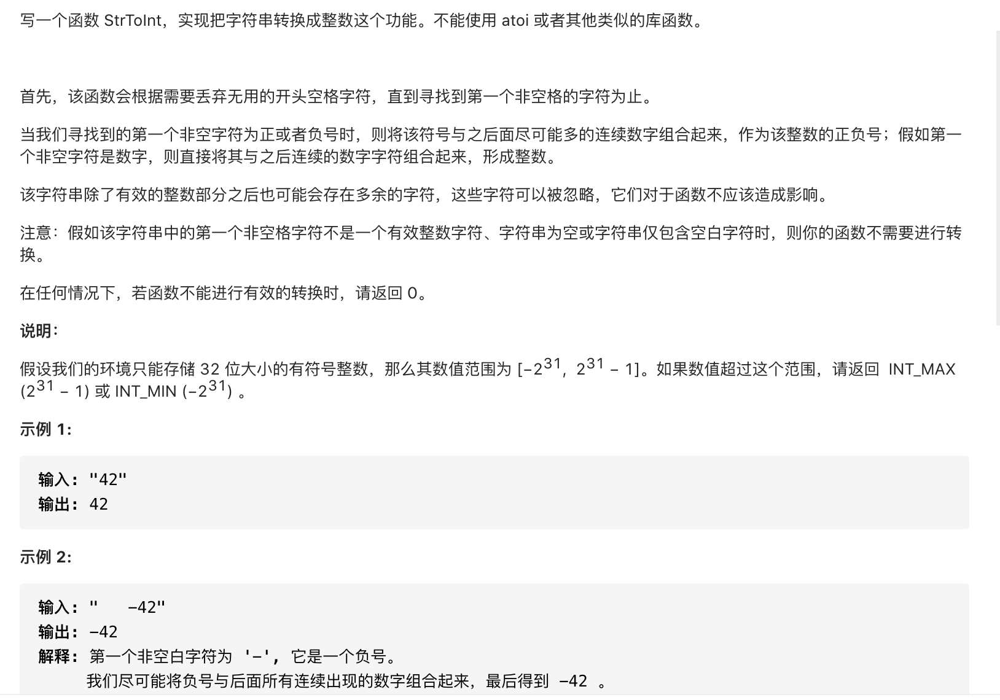

#  **题目描述（简单难度）**

> **[warning] [剑指 Offer 67. 把字符串转换成整数](https://leetcode-cn.com/problems/ba-zi-fu-chuan-zhuan-huan-cheng-zheng-shu-lcof/)**



#解法一：字符串处理

```java
class Solution {
    public int strToInt(String str) {
      str = str.trim();
      if(str.length() == 0){
          return 0;
      }
      int sign = 1;
      int i = 1;
      if(str.charAt(0)=='-'){
          sign = -1;
      }else if(str.charAt(0) != '+'){
          i = 0;
      }
      int number = Integer.MAX_VALUE /10;
      int res = 0;
      for(int j=i;j<str.length();j++){
          if(str.charAt(j) > '9' || str.charAt(j) < '0'){
              break;
          }
          if(res > number || (res==number && str.charAt(j) > '7')){
              return sign == 1?Integer.MAX_VALUE : Integer.MIN_VALUE;
          }
          res = res * 10 + (str.charAt(j) - '0');
      }
      return res*sign;
    }
}
```


