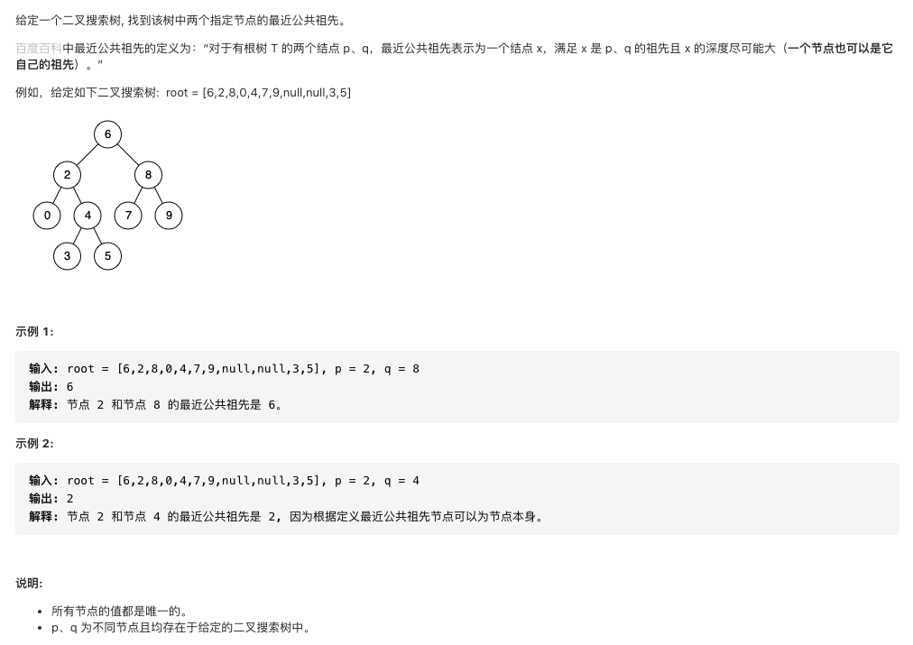

#  **题目描述（简单难度）**

> **[warning] [剑指 Offer 68 - I. 二叉搜索树的最近公共祖先](https://leetcode-cn.com/problems/er-cha-sou-suo-shu-de-zui-jin-gong-gong-zu-xian-lcof/)**



#解法一： 递归 

利用二叉树的特性，如果p 、q 的值小于root ,p q就在root的左边、如果 p、q 的值大于root 就在root的右边
否则在他们的公共祖先就是root

```java
class Solution {
    public TreeNode lowestCommonAncestor(TreeNode root, TreeNode p, TreeNode q) {
        if(root == null){
            return null;
        }
        if(root.val > p.val && root.val > q.val){
            return lowestCommonAncestor(root.left,p,q);
        }
        else if(root.val < p.val && root.val < q.val){
            return lowestCommonAncestor(root.right,p,q);
        }
        else{
            return root;
        }
    }
}
```

解法二： 迭代法
```java
class Solution {
    public TreeNode lowestCommonAncestor(TreeNode root, TreeNode p, TreeNode q) {
        if(root == null){
            return root;
        }
        while(root != null){
            if(root.val > p.val && root.val > q.val){
                root = root.left;
            }
            else if(root.val < p.val && root.val < q.val){
                root = root.right;
            }
            else{
                return root;
            }
        }
        return null;
    }
}
```
