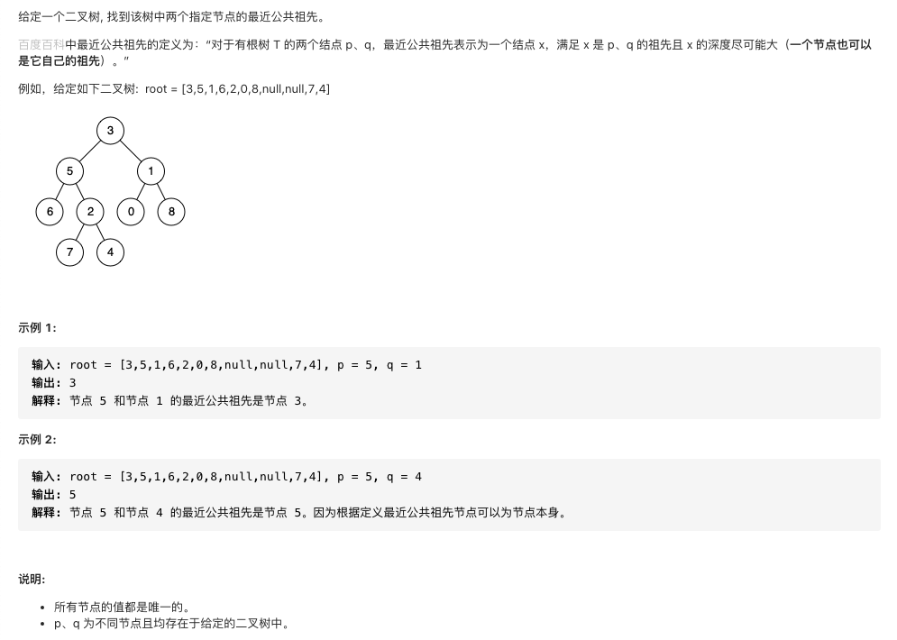

#  **题目描述（简单难度）**

> **[warning] [剑指 Offer 68 - II. 二叉树的最近公共祖先](https://leetcode-cn.com/problems/er-cha-shu-de-zui-jin-gong-gong-zu-xian-lcof/)**



#解法一： 递归

```java
class Solution {
    public TreeNode lowestCommonAncestor(TreeNode root, TreeNode p, TreeNode q) {
        if(root == null){
            return null;
        }
        if(root == p || root == q){
            return root;
        }
        TreeNode left = lowestCommonAncestor(root.left,p,q);
        TreeNode right = lowestCommonAncestor(root.right,p,q);
        if(left != null && right != null){
            return root;
        }
        if(left != null){
            return left;
        }
        if(right != null){
            return right;
        }
        return null;
    }
}
```

简化上面答案
```java
class Solution {
    public TreeNode lowestCommonAncestor(TreeNode root, TreeNode p, TreeNode q) {
        if(root == null){
            return null;
        }
        if(root == p || root == q){
            return root;
        }
        TreeNode left = lowestCommonAncestor(root.left,p,q);
        TreeNode right = lowestCommonAncestor(root.right,p,q);
        if(left == null){
            return right;
        }
        if(right == null){
            return left;
        }
        return root;
    }
}
```

#解法二： hashMap保存父节点
```java
/**
 * Definition for a binary tree node.
 * public class TreeNode {
 *     int val;
 *     TreeNode left;
 *     TreeNode right;
 *     TreeNode(int x) { val = x; }
 * }
 */
class Solution {
    HashMap<Integer,TreeNode> map = new HashMap<>();
    Set<Integer> set = new HashSet<>();
    public TreeNode lowestCommonAncestor(TreeNode root, TreeNode p, TreeNode q) {
        dfs(root);
        while(p != null){
            set.add(p.val);
            p = map.get(p.val);
        }
        while(q !=null){
            if(set.contains(q.val)){
                return q;
            }
            q = map.get(q.val);
        }
        return null;
    }

    public void dfs(TreeNode root){
        if(root == null){
            return;
        }
        if(root.left != null){
            map.put(root.left.val,root);
            dfs(root.left);
        }
        if(root.right != null){
            map.put(root.right.val,root);
            dfs(root.right);
        }
    }
}
```

