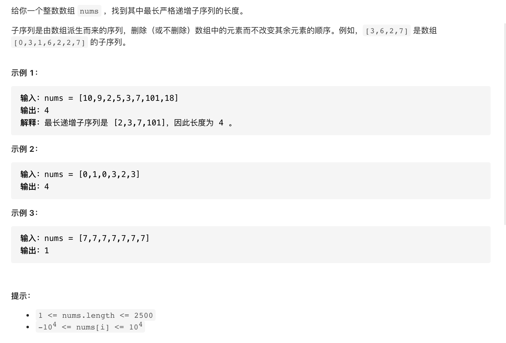
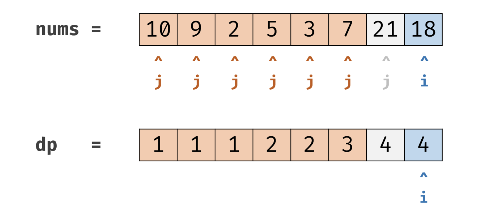

#  **题目描述（中等难度）**

> **[success] [300. 最长递增子序列](https://leetcode-cn.com/problems/longest-increasing-subsequence/)**



#解法一：动态规划



状态转义方程：dp[i] = max(dp[i], dp[j] + 1)

```java
class Solution {
    public int lengthOfLIS(int[] nums) {
     if(null == nums || nums.length == 0){
         return 0;
     }
     int[] dp = new int[nums.length];
     for(int i=0;i<nums.length;i++){
         dp[i] = 1;
     }
     int res = 0;
     for(int i= 0;i<nums.length;i++){
         for(int j=0;j<i;j++){
             if(nums[i] > nums[j]){
                 dp[i] = Math.max(dp[i],dp[j]+1);
             }
         }
        res = Math.max(res,dp[i]);
     }
     return res;
    }
}
```


