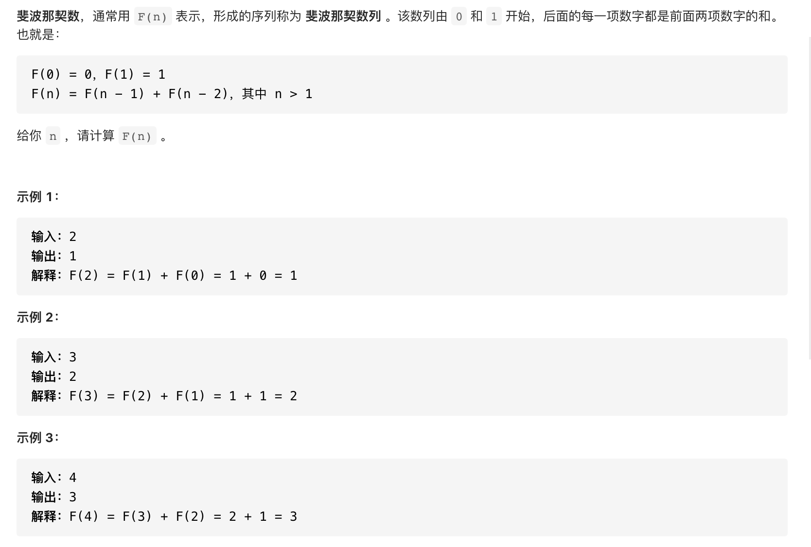

#  **题目描述（简单难度）**

> **[success] [509. 斐波那契数](https://leetcode-cn.com/problems/fibonacci-number/)**



#解法一：暴力递归

```java
class Solution {
    public int fib(int n) {
     if(n == 0 || n==1){
         return n;
     }
     return fib(n-1)+fib(n-2);
    }
}
```
#解法二：备忘录递归
```java
class Solution {
    int[] cache = new int[101];
    public int fib(int n) {
        if(n == 0 || n==1){
            return n;
        }
        if(cache[n] != 0){
            return cache[n];
        }
        cache[n] =  fib(n-1)+fib(n-2);
        return cache[n];
    }
}
```

#解法三：动态规划
```java
class Solution {
    public int fib(int n) {
     if(n == 0){
         return 0;
     }
     int[] dp = new int[n+1];
     dp[0] = 0;
     dp[1] = 1;
     for(int i=2;i<=n;i++){
         dp[i] = dp[i-1]+dp[i-2];
     }
     return dp[n];
    }
}
```
