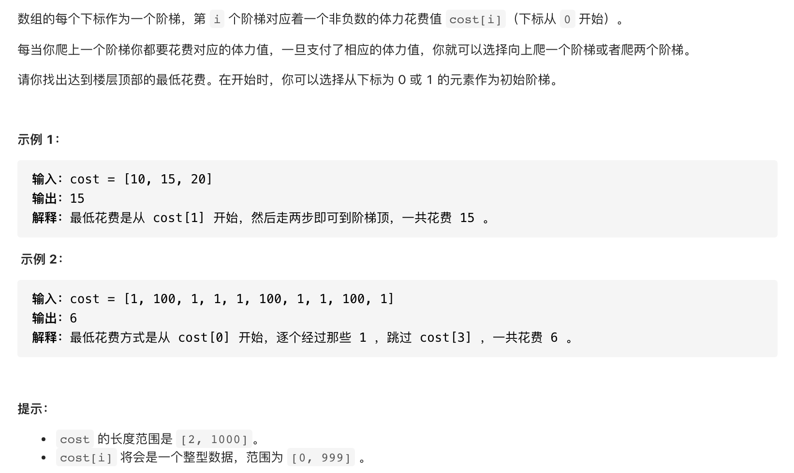

#  **题目描述（简单难度）**

> **[success] [746. 使用最小花费爬楼梯](https://leetcode-cn.com/problems/min-cost-climbing-stairs/)**



#解法一：动态规划

```java
class Solution {
    public int minCostClimbingStairs(int[] cost) {
      int[] dp = new int[cost.length];
      dp[0] = cost[0];
      dp[1] = cost[1];
      for(int i=2;i<cost.length;i++){
          dp[i] = Math.min(dp[i-1],dp[i-2])+cost[i];
      }
      return Math.min(dp[cost.length-1],dp[cost.length-2]);
    }
}
```
