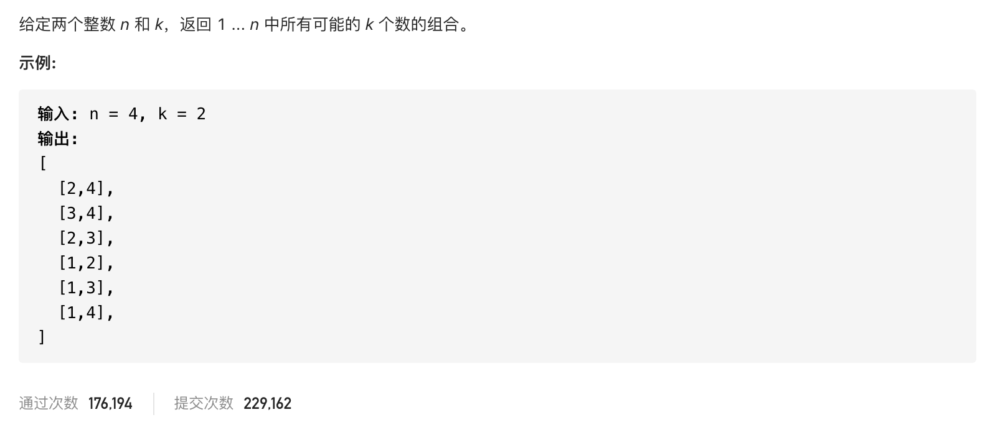

#  **题目描述（中等难度）**

> **[warning] [131. 分割回文串](https://leetcode-cn.com/problems/palindrome-partitioning/)**




```java
class Solution {
    List<List<String>> resp = new ArrayList<>();
    List<String> ans = new ArrayList<>();
    public List<List<String>> partition(String s) {
       backTracking(s,0);
       return resp;
    }

    public void backTracking(String s,int startIndex){
        if(startIndex >= s.length()){
            resp.add(new ArrayList<>(ans));
            return;
        }
        for(int i=startIndex;i<s.length();i++){
            if(isPanda(s,startIndex,i)){
               String str =  s.substring(startIndex,i+1);
               ans.add(str);
            }
            else{
                continue;
            }
            backTracking(s,i+1);
            ans.remove(ans.size()-1);
        }
    }

    //判断是否是否回文
    public boolean isPanda(String s,int start,int end){
        if(s.length() == 1){
            return true;
        }
      while(start < end){
          if(s.charAt(start) != s.charAt(end)){
              return false;
          }
          start++;
          end--;
      }
      return true;
    }
}
```
