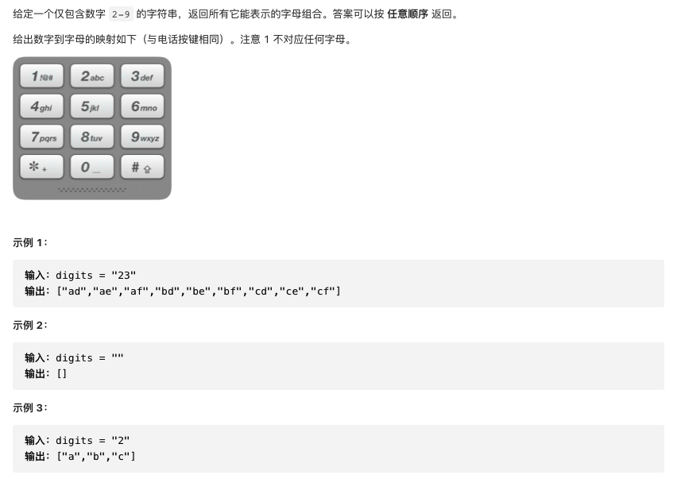

#  **题目描述（中等难度）**

> **[warning] [17. 电话号码的字母组合](https://leetcode-cn.com/problems/letter-combinations-of-a-phone-number/)**



#解法一：回溯

思路：
首先使用哈希表存储每个数字对应的所有可能的字母，然后进行回溯操作。

回溯过程中维护一个字符串，表示已有的字母排列（如果未遍历完电话号码的所有数字，则已有的字母排列是不完整的）。该字符串初始为空。每次取电话号码的一位数字，从哈希表中获得该数字对应的所有可能的字母，并将其中的一个字母插入到已有的字母排列后面，然后继续处理电话号码的后一位数字，直到处理完电话号码中的所有数字，即得到一个完整的字母排列。然后进行回退操作，遍历其余的字母排列。

回溯算法用于寻找所有的可行解，如果发现一个解不可行，则会舍弃不可行的解。在这道题中，由于每个数字对应的每个字母都可能进入字母组合，因此不存在不可行的解，直接穷举所有的解即可。

```java
class Solution {
    List<String> resp = new ArrayList<>();
    StringBuilder sb = new StringBuilder();
    HashMap<Character, String> map = new HashMap<>();
    public List<String> letterCombinations(String digits) {
        if (digits.length() == 0) {
            return resp;
        }
        map.put('0', "");
        map.put('1', "");
        map.put('2', "abc");
        map.put('3', "def");
        map.put('4', "ghi");
        map.put('5', "jkl");
        map.put('6', "mno");
        map.put('7', "pqrs");
        map.put('8', "tuv");
        map.put('9', "wxyz");
        backTracking(digits, 0);
        return resp;
    }

    public void backTracking(String digits, int index) {
        if (index == digits.length()) {
            resp.add(sb.toString());
            return;
        }
        char temp = digits.charAt(index);
        String letter = map.get(temp);
        for (int i = 0; i < letter.length(); i++) {
            sb.append(letter.charAt(i));
            backTracking(digits, index + 1);
            sb.deleteCharAt(index);
        }
    }
}
```
