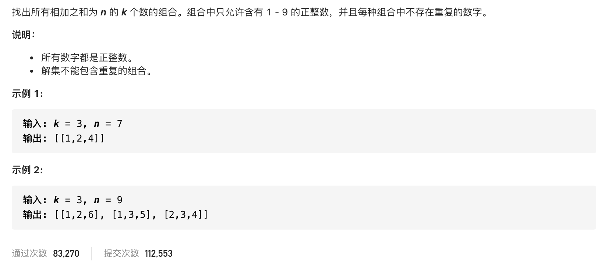

#  **题目描述（中等难度）**

> **[warning] [216. 组合总和 III](https://leetcode-cn.com/problems/combination-sum-iii/)**



#解法一：回溯求出所有组合，对组合求和校验

```java
class Solution {
    List<List<Integer>> resp = new ArrayList<>();
    List<Integer> ans = new ArrayList<>();
    public List<List<Integer>> combinationSum3(int k, int n) {
        backTracking(k,n,1);
        return resp;
    }

    public void backTracking(int k,int n,int startIndex){
       if(ans.size() == k){
          int sum =  ans.stream().mapToInt(o->o).sum();
          if(sum == n){
              resp.add(new ArrayList<>(ans));
              return;
          }
       }
       for(int i=startIndex;i<=9;i++){
           ans.add(i);
           backTracking(k,n,i+1);
           ans.remove(ans.size()-1);
       }
    }
}
```
优化上面代码
```java
class Solution {
    List<List<Integer>> resp = new ArrayList<>();
    List<Integer> ans = new ArrayList<>();
    public List<List<Integer>> combinationSum3(int k, int n) {
        backTracking(k,n,1,0);
        return resp;
    }

    public void backTracking(int k,int n,int startIndex,int sum){
       if(ans.size() == k){
          if(sum == n){
              resp.add(new ArrayList<>(ans));
              return;
          }
       }
       for(int i=startIndex;i<=9;i++){
           if(i>n){
               break;
           }
           sum = sum + i;
           ans.add(i);
           backTracking(k,n,i+1,sum);
           ans.remove(ans.size()-1);
           sum = sum - i;
       }
    }
}
```

#解法二：优化剪支

```java
class Solution {
    List<List<Integer>> resp = new ArrayList<>();
    List<Integer> ans = new ArrayList<>();
    public List<List<Integer>> combinationSum3(int k, int n) {
        backTracking(k,n,1);
        return resp;
    }

    public void backTracking(int k,int n,int startIndex){
       if(ans.size() == k || n <=0){
           if(ans.size() == k && n ==0){
             resp.add(new ArrayList<>(ans));
           }
           return;
       }
       for(int i=startIndex;i<=9;i++){
           if(i>n){
               break;
           }
           ans.add(i);
           backTracking(k,n-i,i+1);
           ans.remove(ans.size()-1);
       }
    }
}
```


